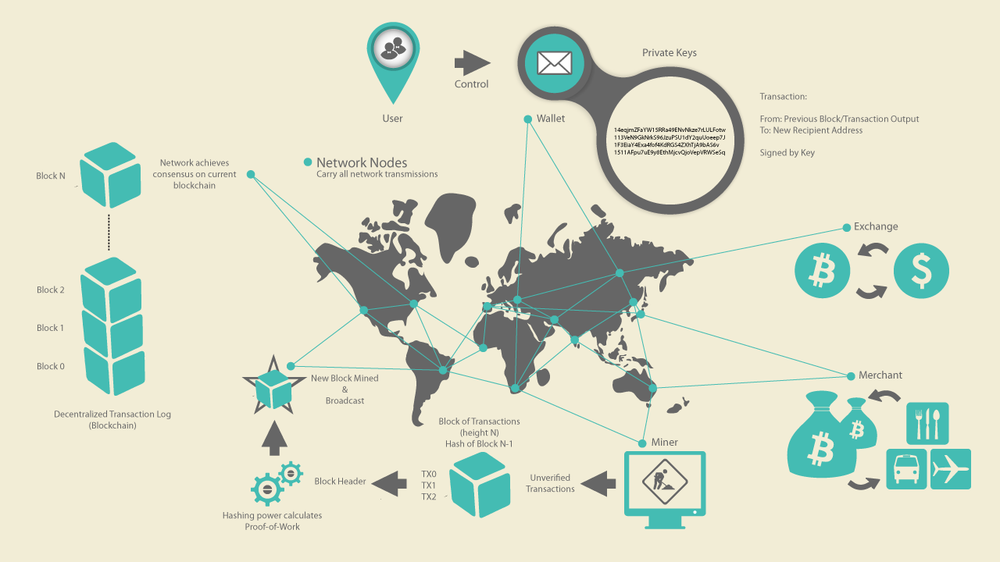
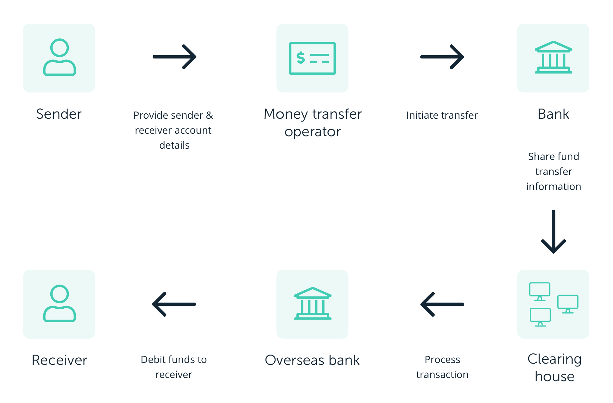
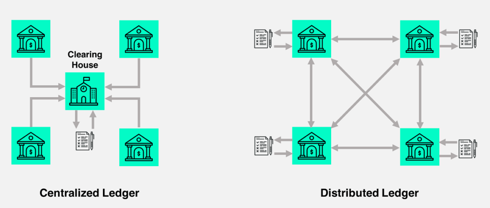
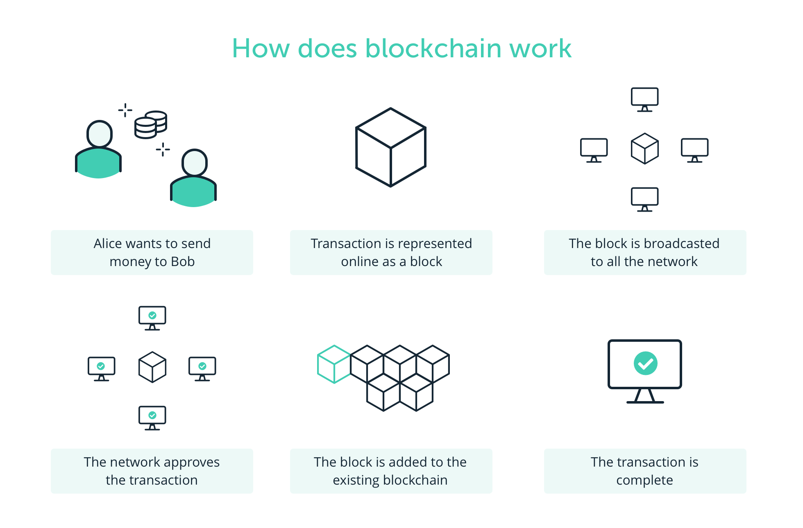
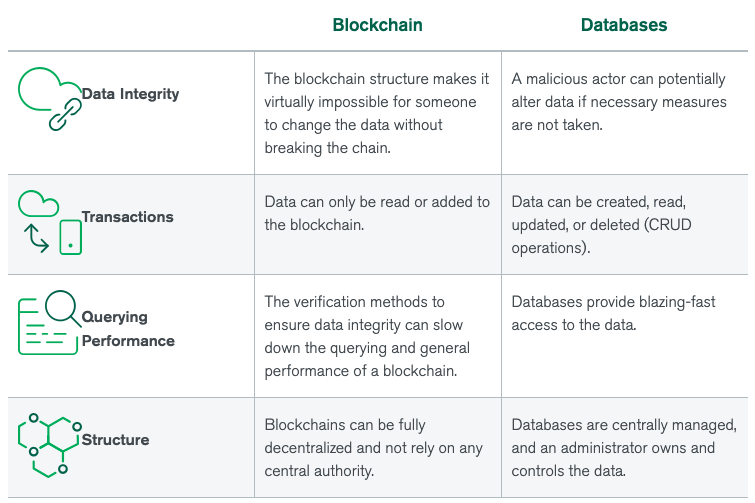

## Why is there so much hype around blockchain technology?

There have been many attempts to create digital money in the past, but they have always failed.

The prevailing issue is trust. If someone creates a new currency called the X dollar, how can we trust that they won't give themselves a million X dollars, or steal your X dollars for themselves?

Bitcoin was designed to solve this problem by using a specific type of database called a blockchain(Blockchain technology, at its core, is no more than a ledger to store information about transactions. To that point, blockchains can be considered as databases). Most normal databases, such as an SQL database, have someone in charge who can change the entries (e.g. giving themselves a million X dollars). Blockchain is different because nobody is in charge; it’s run by the people who use it. What’s more, bitcoins can’t be faked, hacked or double spent – so people that own this money can trust that it has some value.

REF: https://www.euromoney.com/learning/blockchain-explained/what-is-blockchain

## High Level Overview

## Blockchain basics

* Unlike traditional methods, blockchain enables peer to peer transfer of digital assets without any intermediaries.
* It was a technology originally created to support the famous cryptocurrency, BitCoin.

### BitCoin: A Peer-to-Peer Electronic Cash System

* Two major contributions of cryptocurrency Bitcoin are a continuously working digital currency system, and a model 
for autonomous decentralized application technology called the blockchain.

* World wide web has enabled a technology explosion with Web 2.0 and the world of e-commerce applications. 
Around 2008, 2009, when the institutions and markets we trusted went crumbling down, and everybody was 
running away from the Wall Street, a mysterious person, or persons, called Satoshi Nakamoto, 
introduced a new digital currency, a cryptocurrency called Bitcoin.

* Bitcoin enabled an innovative platform for peer to peer transfer of value without any central authority.

#### With no central authority, how did Bitcoin realize trust and security?

By implementing software programs for **validation**, **verification**, **consensus** in a novel infrastructure called the blockchain.

* Later on in about 2012, 2013, computation elements were added to the blockchain infrastructure that has opened up a 
whole world of possibilities beyond simple currency transfer. 
These innovations are significantly shaping the direction of Web 3.0

#### What is a blockchain? 

* Blockchain is about enabling peer to peer transaction in a decentralized network. 

* Establishing trust among unknown peers. Recording the transaction in an immutable distributed ledger.

### Centralised vs Decentralized

Let's understand centralized versus decentralized network using a common scenario. 

Consider a scenario where customer wants to buy an item using her credit card. 
Let's enumerate the intermediaries involved in accomplishing this task. 
We have a credit card agency, we have a customer bank, we have a credit cards bank, we have an exchange, 
we have the merchant's bank, and finally, the merchant. This is an example of a centralized system that we are so used to.

Now compare this with a system where peers can transact directly with each other irrespective of where they are located. 
Functions of the intermediaries are shifted to the periphery to the peer participant in the blockchain infrastructure. 
Peers are not necessarily known to each other. This is a decentralized system. 

#### How do we establish trust among the peers in such a decentralized system? 
By having a process in place to validate, verify, and confirm transactions. 
Record the transaction in a distributed ledger of blocks, create a tamper-proof record of blocks, chain of blocks, and 
implement a consensus protocol for agreement on the block to be added to the chain. 
So, validation, verification, consensus, and immutable recording lead to the trust and security of the blockchain.

### How does blockchain transaction work?

Let's consider a common scenario.

* Say Alice is lending Bob $10,000. This is one single peer to peer transaction. Alice and Bob both make a note of it on a ledger.
* What if Alice changes the entry from $10,000 to $11,000? Alternatively, WHat if Bob changes her entry from $10,000 to $1,000? 
* To prevent this trust violation, we need to seek the help of people around us, Lisa, Allison, and Francis. Provide all of them a valid copy of this ledger.
* This is the basic concept of an immutable distributed ledger defined in a blockchain process.

In this scenario, we were all physically present in one location, Amherst. Now imagine this to be an online transaction to an unknown peer. Also, scale up the one transaction to 10,000 transactions, how about a million transactions.

I should be able to transact with equal ease to any unknown peer in Amherst, Albany, or Albania, maybe to send some flowers to a friend in Albania. This is the tenet of a decentralized system supported by blockchain.

In the case just described, how do we trust our unknown peers? Through verification and validation. In our example, Bob requests Kevin to verify the amount Alice transacted with her.

Kevin checks it, oops, Kevin finds the amount of the transaction is not 10,000, but 300, not valid. Kevin rejects and nullifies the transaction. Similar to these, validation, then verification methods devised by the blockchain and implemented by the peers provide the collector trust needed in a decentralized system. Summarizing, blockchain technology supports methods for a decentralized peer-to-peer system, a collective trust model, and a distributed immutable ledger of records of transactions.

This idea of a ledger is the starting point for understanding bitcoin. 
It is a place to record all transactions that happen in the system, and it is open to and trusted by all system participants.

**How can you build a ledger for use in an environment like the Internet where participants may not trust each other?**

Let's start with the easy part: the choice of data structure. There are a few desirable properties. The ledger should be immutable or, more precisely, _append only_: you should be able to add new transactions but not remove, modify, or reorder existing ones. There should also be a way to obtain a succinct _cryptographic digest_ of the state of the ledger at any time. 

* A digest is a short string that makes it possible to avoid storing the entire ledger, knowing that if the ledger were tampered with in any way, the resulting digest would change, and thus the tampering would be detected. 
 
* The reason for these properties is that unlike a regular data structure that's stored on a single machine, the ledger is a global data structure collectively maintained by a mutually untrusting set of participants. This contrasts with another approach to decentralizing digital ledgers, in which many participants maintain local ledgers and it is up to the user querying this set of ledgers to resolve any conflicts.

### Consensus Protocol
In Bitcoin, remember that a new block is created and added to the chain every 10 minutes. Those blocks are determined to be valid and appended to the blockchain by the distributed nodes in the network — no clearinghouse. They perform this function via [Nakamoto Consensus](https://blockonomi.com/nakamoto-consensus/), which is a version of a concept known as “Proof of Work” or _Byzantine Fault Tolerance_ in distributed computing.

Through a series of clever game theory incentives, cryptography, and distributed consensus, a blockchain can achieve secure and accurate consensus on the state of the ledger, just like a central clearinghouse, but over a decentralized network where no single entity is in control.   

Cryptography in blockchains makes the verification of data (i.e., transactions) trivial, and nearly impossible to forge. This task is performed by network operators that run nodes and automatically validate the blocks and transactions in the network through a set of consensus rules, which can be run by anyone with a computer on a public, permissionless blockchain like Bitcoin.

### Key takeaways
A public blockchain is a distributed ledger, similar to a database, which has different key attributes:

- decentralized: there are no third party involved
- distributed: the ledger is spread across the whole network, which makes tempering difficult
- encrypted
- anonymous 
- once a data is added to the ledger, it cannot be removed or altered

### Bitcoin is an application that uses the blockchain.

Blockchain Technology combines 4 crucial concepts
* Cryptography to ensure messages cannot be faked
* A Consensus Algorithm
* A data structure for storage
* Distribution via Peer-to-Peer protocols

For Bitcoin, those choices are:
* Cryptography: Bitcoin uses ECDSA for signatures, double SHA-256 for hashing
* Consensus Algorithm: Proof of Work (Proof of Stake would be an alternative)
* Storage: Merkle Tree
* Distribution: A TCP-based peer-to-peer protocol

### Blockchains vs DB

The ultimate goal of a blockchain is to store information, which makes it a database. Blockchains only differ from other database types by the way they store data. REF: https://www.mongodb.com/databases/blockchain-database

#### Why is a blockchain ledger more reliable than a database system?

A blockchain ledger is composed of multiple blocks containing information about transactions. Every transaction in a block is signed using a public key cryptographic algorithm. The block itself is also signed with an SHA-256 signature. The next block in the chain uses this previous signature to link to the rest of the chain. Finally, most of the validation nodes need to approve this new block to be added to the chain. This mix of signatures and consensus makes it so that data in a blockchain cannot be altered without tremendous computational power.

### Ref

#### Title of resource: Bitcoin Whitepaper

Resource type: Paper http://www.bitcoin.org/bitcoin.pdf

Description: This paper was released by Satoshi Nakamoto prior to the release of the now famous cryptocurrency Bitcoin.

#### Title of resource: Bitcoin's Academic Pedigree

Resource type: Paper https://queue.acm.org/detail.cfm?id=3136559

Description: How Bitcoin, a radically different proposal for a decentralized cryptocurrency showed that digital cash could be viable.

#### Title of resource: What is Blockchain Technology? A Step-by-Step Guide For Beginners

Resource type: Website, https://blockgeeks.com/guides/what-is-blockchain-technology/

Description: A step by step guide that goes into the details of what Blockchain technology is.

#### Title of resource: Blockchain: The Invisible Technology That's Changing the World

Resource type: Website, https://www.pcmag.com/article/351486/blockchain-the-invisible-technology-thats-changing-the-wor

Description: Article that expands on a new immutable digital fabric remaking the internet without people even realizing it. It also shows how Blockchain-based networks, decentralized apps (DApps), and distributed ledgers are becoming the foundation of digital life.

REF: https://www.ledger.com/academy/blockchain/what-is-blockchain
REF: https://medium.com/coinmonks/the-blockchain-473aac352e5
