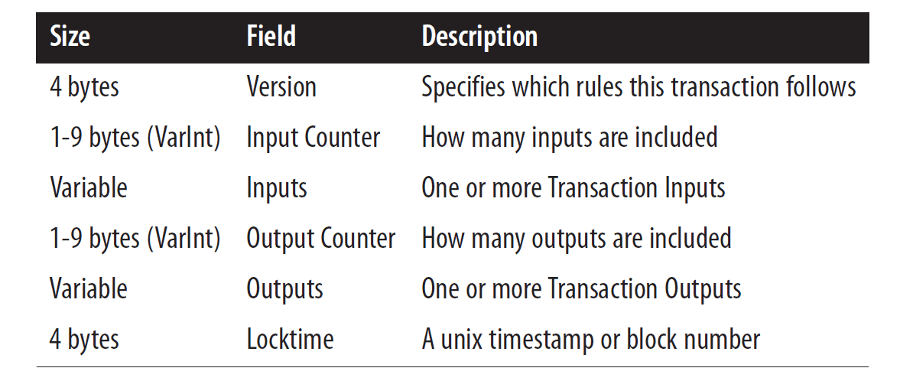
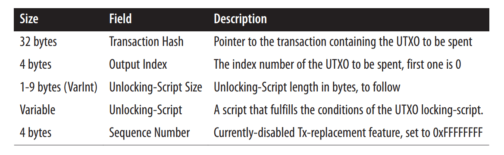
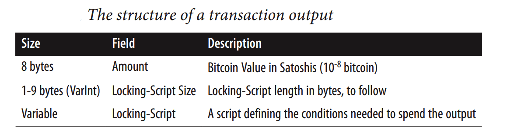
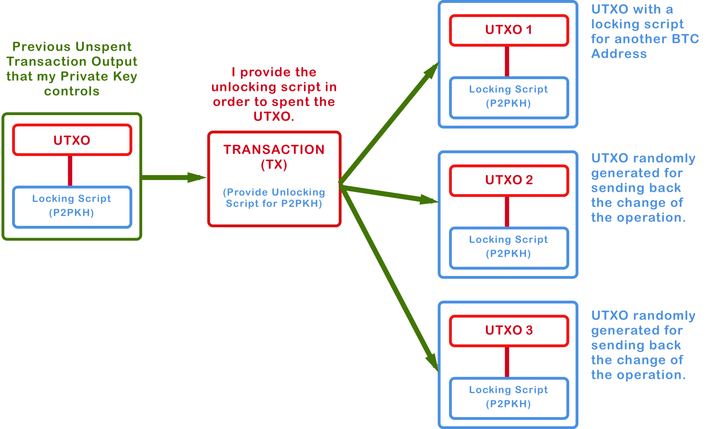
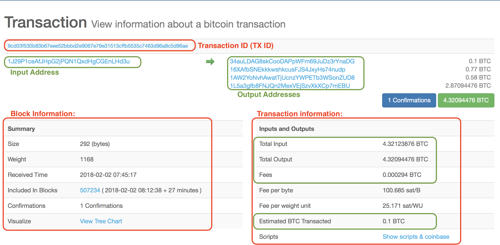
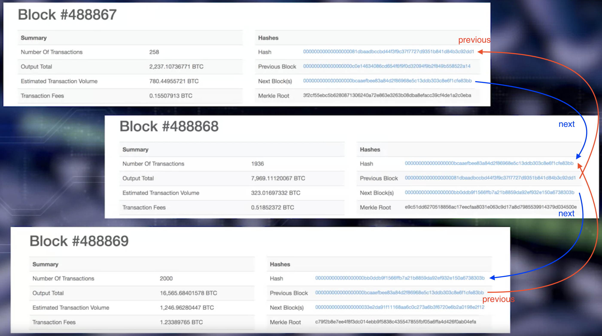
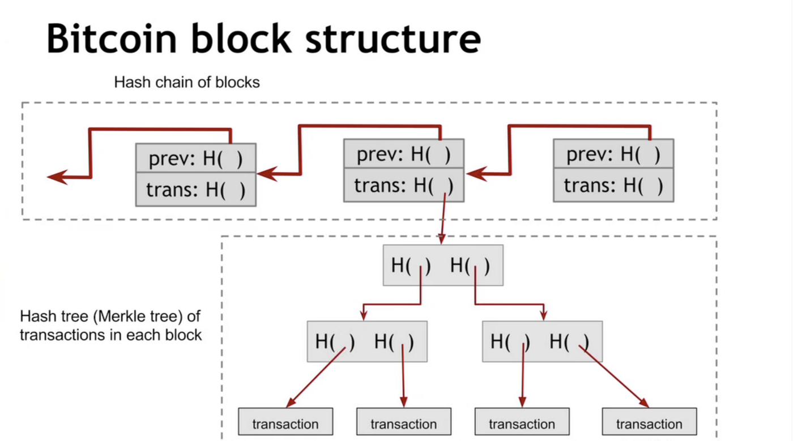

Here is the basic structure of a blockchain. 
* **Transaction** is the basic element of the Bitcoin Blockchain. Transactions are validated and broadcast. 
* Many transactions form a **block**. Many box form a chain through a digital data link. 
* Blocks go through a consensus process, to select the next block that will be added to the **chain**. Chosen block is verified, and added to the current chain.
* Validation and consensus process are carried out by special peer nodes called **miners**. These are powerful computers executing software defined by the blockchain protocol. 

```
There are no accounts or balances in bitcoin; 
there are only unspent transaction outputs (UTXO) scattered in the blockchain.
```

Let's now discuss the details of a single transaction in bitcoin. 
* A fundamental concept of a bitcoin network is an **Unspent Transaction Output**, also known as **UTXO**. 
* The set of all UTXOs in a bitcoin network collectively defined the state of the Bitcoin Blockchain.
* UTXOs are referenced as inputs in a transaction. UTXOs are also outputs generated by a transaction.
* All of that UTXOs is in a system, are stored by the participant nodes in a database.


Now let's review the role of the UTXO's in a Bitcoin Blockchain.
* The transaction uses the amount specified by one or more UTXOs and transmits it to one or more newly created output UTXOs, according to the request initiated by the sender. 

### UTXO Structure

Structure of UTXO:
*  It includes a unique identifier of the transaction that created this UTXO
*  an index or the position of the UTXO in the transaction output list
*  a value or the amount it is good for
*  And an optional script, the condition under which the output can be spent

A UTXO consists of a locking script & the amount that is to be transferred. The locking script locks the transaction amount. For someone to use the transaction amount, an unlocking script is required.

Think of UTXO as a safe-deposit box that locks some amount of bitcoin. Anyone that has the key to that safe can spend that bitcoin.

So to make a transaction, Bob asks Alice for her bitcoin address. He then creates a UTXO with an amount of 5 BTC and a locking script using Alice's bitcoin address such that only Alice can create an unlocking script using her private key.

```
Sending someone bitcoin is basically creating an unspent transaction output (UTXO) that is 
cryptographically locked and can only be accessed by the receiver's private key.
```

We can use the blockchain.info API(API URL is `https://blockchain.info/unspent?active=<address>`) to find the unspent outputs (UTXO) of a specific address(example address:  `1Dorian4RoXcnBv9hnQ4Y2C1an6NJ4UrjX`). 

It returns a JSON object with a list `unspent_outputs`, containing UTXO, like this:

```json
{
    "unspent_outputs": [
        {
            "tx_hash": "ebadfaa92f1fd29e2fe296eda702c48bd11ffd52313e986e99ddad9084062167",
            "tx_index": 51919767,
            "tx_output_n": 1,
            "script": "76a9148c7e252f8d64b0b6e313985915110fcfefcf4a2d88ac",
            "value": 8000000,
            "value_hex": "7a1200",
            "confirmations": 28691
        },
        ...
    ]
}
```

### Transaction

Structure of Transaction:
* The transaction itself includes a reference number of the current transaction
*  references to one no more input UTXOs
*  references to one or more output UTXOs newly generated by the current transaction
*  and the total input amount and output amount

A bitcoin transaction is just an entry in the blockchain that indicates transfer of bitcoins. Transaction of bitcoins is quite different from a banking transaction. In a banking system, you have an account where you store all your money. To make a transaction you'd transfer money from your account to the receiver's account. In Bitcoin, there's no such thing as an Account.

Recall, the blockchain is just a list of transactions. There is no such entry in the blockchain that states that Bob's account has 5 BTC or even that there's an account that belongs to Bob. To put it precisely, there's no concept of balance in Bitcoin.

So how and where does one store bitcoins? To answer that we need to understand transactions.

A transaction comprises of a bunch of metadata which are shown below.


Structure of a bitcoin transaction. Source: Mastering Bitcoin by Andreas Antonopolous

Inputs structure


Outputs structure



#### UTXO and Transaction

The transaction uses the amount specified by one or more input UTXOs and transfers it to one or more newly created output UTXOs. 

The UTXO is a discrete and indivisible unit of value denominated in satoshis. The first question that comes to mind when we say that UTXO’s are indivisible: what happens when we try to spend less than the UTXO’s that we own? Let’s see an example:

* I want to send Sarah, `0.5` Bitcoins, and in my Balance I have `1` bitcoin that came from only one UTXO, so I can’t divide the UTXO of one bitcoin, I must send the entire bitcoin in the transaction, and create another output as my change. 
* Similar as when we pay with a five dollar bill something that is only two dollars, we can’t divide the five dollar bill, so we pay with the entire five dollar bill and receive three dollars as change. This is an important aspect about bitcoin transactions.



#### Transaction example

The data structure of transactions does not have a field for fees. Instead, fees are implied as the difference between the sum of inputs and the sum of outputs. Any excess amount that remains after all outputs have been deducted from all inputs is the fee that is collected by the miners.

`Fees = Sum(Inputs) – Sum(Outputs)`



If we watch again the bitcoin transaction chart, we’ll see that there’s a total input of `4.32123876` BTC from a previously UTXO, in the estimated bitcoin transacted we see `0.1` BTC, and in the outputs we can see 4 different addresses, probably the one with `0.1` BTC is the receiver of the transaction, and the other three are random generated address to give back the change. 

For security and anonymity reasons some wallets will generate random bitcoin addresses and divide the change payments in order to make it more difficult to track the spent funds, that’s also why we see an “estimated” bitcoin transacted.

#### Bitcoin transaction properties with example

A Bitcoin transaction has the following data properties expressed in JSON format:

```go
{
  "txid" : "id",        (string) The transaction id (same as provided)
  "hash" : "id",        (string) The transaction hash (differs from txid 
                                 for witness transactions)
  "size" : n,           (numeric) The serialized transaction size
  "vsize" : n,          (numeric) The virtual transaction size (differs 
                                  from size for witness transactions)
  "version" : n,        (numeric) The version
  "locktime" : ttt,     (numeric) The lock time
  "vin" : [             (array of json objects)
     {
       "txid": "id",    (string) The transaction id
       "vout": n,       (numeric)
       "scriptSig": {   (json object) The script
         "asm": "asm",  (string) asm
         "hex": "hex"   (string) hex
       },
       "sequence": n    (numeric) The script sequence number
       "txinwitness": ["hex", ...] (array of string) hex-encoded witness 
                                  data (if any)
     }
     ,...
  ],
  "vout" : [            (array of json objects)
     {
       "value" : x.xxx,     (numeric) The value in BTC
       "n" : n,             (numeric) index
       "scriptPubKey" : {   (json object)
         "asm" : "asm",     (string) the asm
         "hex" : "hex",     (string) the hex
         "reqSigs" : n,     (numeric) The required sigs
         "type" : "pubkeyhash",  (string) The type, eg 'pubkeyhash'
         "addresses" : [    (json array of string)
           "address"        (string) bitcoin address
           ,...
         ]
       }
     }
     ,...
  ],
  "blockhash" : "hash",   (string) the block hash
  "confirmations" : n,    (numeric) The confirmations
  "time" : ttt,           (numeric) The transaction time in seconds since 
                                    (Jan 1 1970 GMT)
  "blocktime" : ttt       (numeric) The block time in seconds since (Jan 1 
                                    1970 GMT)
}
```

Let's take a look at the transaction from Bitcoin Test Network:

```shell
C:\>\local\bitcoin-0.15.1\bin\bitcoin-cli.exe -testnet getrawtransaction 
   e22d5998a43e3e1d81784e6e92988d1c4eae77cd0e439542337e48a786c75e69 true
```

```json
{
    "txid":"e22d5998a43e3e1d81784e6e92988d1c4eae77cd0e439542337e48a786c75e69",
    "hash":"e22d5998a43e3e1d81784e6e92988d1c4eae77cd0e439542337e48a786c75e69",
    "version":2,
    "size":225,
    "vsize":225,
    "locktime":1281294,
    "vin":[
        {
            "txid":"6f6e35c52b7a00c4b496a7191296c29fe98248e869471c92c87c47885dc54baa",
            "vout":0,
            "scriptSig":{
                "asm":"304402202ab88452cd720f3e42731a5fd1345e5f2c6888a3d0a0568abf315c46e6b038cf02
20394e02c12aecd9bb2356b4b09980476a4cb347b9e96088f39c995d6d0302fd76[ALL] 
0387ab1fa2aedc1dfe5fd8fba9275455b392db1e3b7bad3a8d611fb3cdb789f84d",
                "hex":"47304402202ab88452cd720f3e42731a5fd1345e5f2c6888a3d0a0568abf315c46e6b0..."
            },
            "sequence":4294967294
        }
    ],
    "vout":[
        {
            "value":847.54623264,
            "n":0,
            "scriptPubKey":{
                "asm":"OP_DUP OP_HASH160 c14be92816c5ccfa8c742acba43ee5382ce22eac 
OP_EQUALVERIFY OP_CHECKSIG",
                "hex":"76a914c14be92816c5ccfa8c742acba43ee5382ce22eac88ac",
                "reqSigs":1,
                "type":"pubkeyhash",
                "addresses":[
                    "my91eT3mdFdo9gfe85wu2Ex35sNRS3uVwJ"
                ]
            }
        },
        {
            "value":7.03666753,
            "n":1,
            "scriptPubKey":{
                "asm":"OP_DUP OP_HASH160 5e25fd265324c70a1a8bbbeb969614d39f6f6647 
OP_EQUALVERIFY OP_CHECKSIG",
                "hex":"76a9145e25fd265324c70a1a8bbbeb969614d39f6f664788ac",
                "reqSigs":1,
                "type":"pubkeyhash",
                "addresses":[
                    "mp6mKbgWE25PyyX63zJ8SRibrKugHMkJDE"
                ]
            }
        }
    ],
    "hex":"0200000001aa4bc55d88477cc8921c4769e84882e99fc2961219a796b4c4...",
    "blockhash":"0000000000000db32dee811e7a0c1caefc60fbbbf5db88464877f4c97988ea14",
    "confirmations":2271,
    "time":1518381726,
    "blocktime":1518381726
}
```

Participants can validate the transaction contents.

Does the UTXO's reference input exist in the network state? This is the only one of the many validation criteria. Say Alice gives Bob $10,000 in an envelope. This is similar to Alice asking Bob to verify the money in the envelope to be $10,000.

### Blocks

Now, let's look at the structure of the Blockchain by peeking into the Bitcoin Blockchain. 

A block is composed of a header of information about the block and a set of valid transactions.

Our goal is to understand the link between the blocks. 

Let's consider the chain of three blocks: 488867, 488868. 488869. 488868 shown in the middle, has the hash of 488867 as its previous hash. 

Block 488869 has the hash of 488868 as its previous hash, forming the links in the chain. 





This chain of transaction cannot be tampered with, which makes the ledger so secure. Lets see why this blockchain cannot be tampered with. 
* Suppose an adversary wants to modify a transaction which is present in a block in the blockchain. 
* If he/she does so, then it will change the hash which is maintained by the next block (prev pointer), so that the new data matches with its hash which is present in the next block. 
* If the adversary somehow changes the hash in the next block to match the modified data in the current block, then it will change the hash of the next block which is present as the previous point in the block next to the next block. 
* So we can see that if someone tries to change even a single bit of data in the blockchain, he/she will have to modify the entire block starting from the genesis block (the first block in the blockchain) to the current head pointer of the blockchain. 

This is virtually impossible in a distributed network which uses distributed consensus to verify any transaction added to the blockchain.

### Summary

* To summarize, transaction bring about transfer of value in the Bitcoin Blockchain. 

* The concept of UTXO defines the inputs and outputs of such a transaction. 

* Once a block is verified an algorithmic-ally agreed upon by the miners, it is added to the chain of blocks, namely the Blockchain.


### Bitcoin and Ethereum's account model

The UTXO system is like a digital recreation of a cash economy. For example, Alice gives Bob 1 BTC , and the system now recognizes that there is 1 BTC signed to Bob that he has not yet given to anyone else. If Bob already had 1 BTC, then his balance on the blockchain would be 1 BTC + 1 BTC. Bob’s Bitcoin balance is the sum of all Bitcoin signed to him, similar to how all the fiat cash in Bob’s leather wallet is the sum of all fiat cash given to him. If he wants to combine his two separate BTC, he must do so in another transaction, much like he needs to do if combining two $5 bills into a $10 bill.

In contrast, the Ethereum’s account model is like a bank account that automatically maintains user balances, similar to how a bank maintains a single balance amidst spending and receiving funds. When Alice gives Bob 1 ETH, the system now recognizes that Bob’s balance has gone up by 1 ETH and Alice’s has gone down. If Bob already had 1 ETH, then his balance on the blockchain would be 2 ETH. He does not need another exchange to combine them in his account.


REF: https://www.adityathebe.com/what-does-it-mean-to-own-bitcoins

REF: https://mlsdev.com/blog/156-how-to-build-your-own-blockchain-architecture

REF: https://smithandcrown.com/glossary/unspent-transaction-outputs-utxo/
