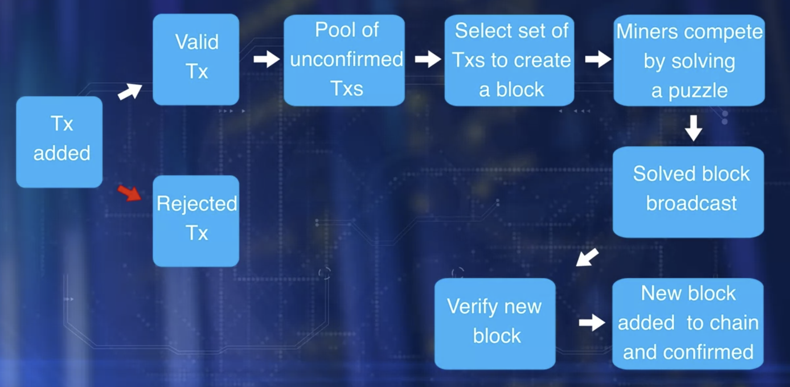

* The algorithm for consensus in the Bitcoin blockchain is called **Proof of Work** protocol.
It gets its name because it involves “work” or computational power to solve the puzzle and to claim the right to form the next block.

* Transaction confirmation is independently performed by all miner nodes.
Miners, take on added work or computation to verify transactions, broadcast transactions, compete to claim the right to create a block,
work on reaching consensus by validating the block, broadcasting the newly created block and confirming transactions. 

* Transaction 0 in every block in the bitcoin blockchain
  - is for paying the miner fees
  - does not have any input UTXO
  - is called the coinbase transaction

### Basic operations in block chain
Operations in the decentralized network are the responsibility of the peer participants and their respective computational nodes.
* Validation of Transactions
* Gathering transactions for a block
* Broadcasting valid transacitons & blocks
* Consensus on next block creation
* Chaining blocks to form an immutable record

### Roles of participant
* Can initiate transfer of value by creating a transaction
* Miners: who pick on added work or computation to verify transactions, broadcast transaction, 
compete to claim the right to create a block, work on reaching consensus by validating the block, 
broadcasting the newly created block, and confirming transactions.

You might wonder why participant would take on additional work. 
Well, the miners are incentivised with bitcoins for the efforts in managing the blockchain.

Transaction validation is carried out independently by all miners. 
The process involves validation of more than 20 criteria, including size, syntax, et cetera. 
Some of these criteria are: Referenced Input Unspent Transaction Output, UTXOs are valid, 
reference output UTXOs are correct, reference input amount and output amount matched sufficiently, 
invalid transactions are rejected and will not be broadcast.

All the valid transactions are added to a pool of transactions. Miners select a set of transaction from this pool to create a block. This creates a challenge. If every miner adds the block to the chain, there will be many branches to the chain, resulting in inconsistent state. Recall, the blockchain is a single consistent linked chain of flux. 

We need a system to overcome this challenge, the solution. Miners compete to solving a puzzle to determine who earn the right to create the next block. In the case of bitcoin blockchain, this puzzle is a computational puzzle which is CPU intensive. 

Once a miner solves the puzzle, the announcement is broadcast to the network and the block is also broadcast to the network. Then, other participant verify the new block. Participants reach a consensus to add a new block to the chain. This new block is added to their local copy of the blockchain. Thus, a new set of transactions are recorded and confirmed. The algorithm for consensus is called **proof-of-work protocol**, since it involves work a computational power to solve the puzzle and to claim the right to form the next block.

Transaction zero, index zero of the confirmed block is created by the miner of the block. It has a special UTXO and does not have any input UTXO. It is called the coinbase transaction that generates a minor's fees for the block creation. This is how new coin is minted in bitcoin. 

To summarize, the main operations in a blockchain are **transaction validation** and **block creation with the consensus of the participants**. There are many underlying implicit operations as well in the bitcoin blockchain.

The problem with Proof-of-work is that it is resource-intensive and creates a centralizing tendency among miners based on computer resource capability.

### Reference

Must read: https://onezero.medium.com/how-does-the-blockchain-work-98c8cd01d2ae 

Description: An article written by Michele D'Aliessi on Medium that explains blockchain technology in simple words.

How Do Bitcoin Nodes Verify Transactions? https://smartereum.com/8970/how-do-bitcoin-nodes-verify-transactions/

Description: An article describing some of the features that mining nodes check for transaction validation.
