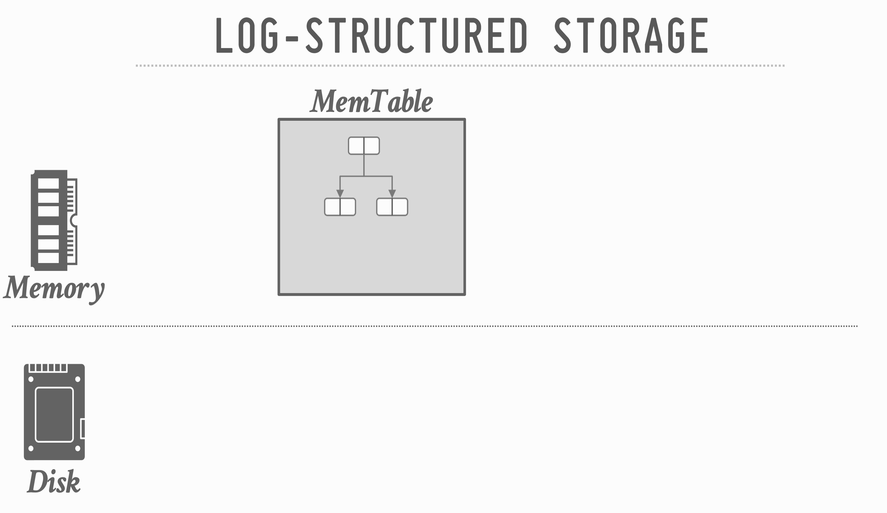

# Storage Part 2: Log-Structured Storage & Tuple Storage

> CMU 15-445/645 — Lecture 4: Database Storage (Part 2)  
> Ref: https://15445.courses.cs.cmu.edu/fall2024/slides/04-storage2.pdf

## Table of Contents
- [Tuple-Oriented Storage: Reads](#tuple-oriented-storage-reads)
- [Tuple-Oriented Storage: Writes](#tuple-oriented-storage-writes)
- [Log-Structured Storage](#log-structure-storage)
  - [Compaction](#compaction)
  - [LSM Trees](#lsm-trees)
- [Storage of Tuples](#storage-of-tuples)
  - [Word Alignment](#word-alignment)
  - [Large Values](#large-values)
  - [System Catalogs](#system-catalogs)

---

## Tuple-Oriented Storage: Reads


Get an existing tuple using its **record ID**:
1. Check page directory to find location of page
2. Retrieve the page from disk (if not in memory)
3. Find offset in page using slot array

The DBMS relies on **indexes** to find individual tuples because the tables are inherently unsorted. But what if the DBMS could keep tuples sorted automatically using an index?


Reads and the need for indexing


### Observation

Both tuple-oriented and log-structured storage approaches rely on **indexes** to find individual tuples. Indexes are necessary because the tables are inherently unsorted.

What if the DBMS could keep tuples sorted automatically using an index?


### Index-Organized Storage

The DBMS stores a table's tuples as the value of an index data structure (typically a **B+Tree**).
- Still uses a page layout that looks like a slotted page
- Tuples are sorted in a page based on a key
- Used by: SQLite, MySQL (InnoDB), Oracle, SQL Server

> "B+Tree pays maintenance costs upfront, whereas LSMs pay for it later."


## Tuple-Oriented Storage: Writes


**Insert** a new tuple:
1. Check page directory to find a page with a free slot
2. Retrieve the page from disk (if not in memory)
3. Check slot array to find empty space in page that will fit

**Update** an existing tuple using its record ID:
1. Check page directory to find location of page
2. Retrieve the page from disk (if not in memory)
3. Find offset in page using slot array
4. If new data fits, overwrite existing data
5. Otherwise, mark existing tuple as deleted and insert new version in a different page


### Problems with Tuple-Oriented Storage

1. **Fragmentation** — Pages are not fully utilized (unusable space, empty slots after deletions)
2. **Useless Disk I/O** — DBMS must fetch entire page to update one tuple
3. **Random Disk I/O** — Worst case: each tuple to update is on a separate page

What if the DBMS **cannot** overwrite data in pages and could only create new pages?  
Examples: some object stores, HDFS, Google Colossus.

## Log Structure Storage

Instead of storing tuples in pages and updating them in-place, the DBMS maintains a **log** that records changes to tuples.
- Each log entry represents a tuple **PUT** or **DELETE** operation
- Originally proposed as log-structured merge trees (LSM Trees) in 1996

The DBMS applies changes to an in-memory data structure (**MemTable**) and then writes out the changes sequentially to disk (**SSTable**).





**Read path**: To find a key, the DBMS checks:
1. **MemTable** (in memory) — newest data
2. **SummaryTable** (in memory) — stores min/max key per SSTable + bloom filter per level
3. **Level 0 → Level 1 → ... → Level k** SSTables on disk

**SSTable** (Sorted String Table): A file of key-value pairs, sorted by key (low → high).
- Each log record must contain the tuple's unique identifier
- PUT records contain the tuple contents
- DELETE marks the tuple as deleted
- The DBMS appends log records to the end of the file without checking previous records


Periodically compact SSTables to reduce wasted space and speed up reads.
- Use a **sort-merge** algorithm: only keep the "latest" value for each key
- Newer records take precedence over older ones
- DELETEs remove the key entirely from the merged output

### Compaction

Two main compaction strategies:


**Leveled Compaction** (used by RocksDB):
- Data is organized into levels with SSTable **size limits** per level
- SSTables in a level are **non-overlapping** on key ranges (except Level 0)
- Level 0 contains SSTables recently flushed from memory — these **may** have overlapping ranges
- Compactions merge a file from one level into the next lower level, maintaining sorted, non-overlapping key ranges
- Better for **read-heavy** workloads (fewer SSTables to check per read)


**Universal (Tiered) Compaction** (used by Cassandra):
- SSTables reside in a single "universal" level (no multi-level hierarchy)
- DBMS triggers compaction when too many SSTables overlap in key ranges or exceed size thresholds
- Better for **write-heavy** workloads and time-oriented queries

| | Leveled | Universal (Tiered) |
|---|---------|-------------------|
| Write amplification | Higher | Lower |
| Read performance | Better (fewer SSTables) | Worse (more SSTables to scan) |
| Space amplification | Lower | Higher |
| Best for | Read-heavy workloads | Write-heavy workloads |

### LSM trees

The **LSM Tree** (Log-Structured Merge Tree) is the overall architecture that ties together MemTables, WAL, SSTables, and compaction.


**Write-Ahead Log (WAL)**: Before writing to the MemTable, the DBMS first writes the operation to a sequential log on disk. This ensures that in-memory writes aren't lost if the system crashes before flushing to an SST file.

We use WAL so that in-memory writes aren't lost before we create an immutable SST file 


**Write path:**
1. Write operation goes to **WAL** (sequential write on disk) for durability
2. Simultaneously written to the active **MemTable** (in memory, typically a skip list or red-black tree)
3. When MemTable is full → becomes **immutable** (read-only)
4. Immutable MemTable is **flushed** to disk as a new Level 0 SST file
5. Background **compaction** merges SST files into lower levels

**Read path:**
1. Check active MemTable
2. Check immutable MemTable (if exists)
3. Check SST files level by level (L0 → L1 → ... → Lk)
4. Use bloom filters to skip levels that definitely don't contain the key


LSM Tree, Optimization for reads, use a bloom filter


**Bloom Filters** are probabilistic data structures that answer: "Is this key *possibly* in this SSTable?"
- **False positives** possible (says "maybe" when key is absent) — triggers an unnecessary disk read
- **False negatives** impossible (if it says "no", the key is definitely not there) — safely skip the SSTable
- Dramatically reduces the number of SSTables read during a lookup
- Stored in the SummaryTable in memory for fast access


**History of LSM Trees:**

| Year | System | Significance |
|------|--------|-------------|
| 1992 | LSF (Log-Structured Filesystem) | Design and implementation of a log-structured file system |
| 1996 | LSM Tree | Original paper by O'Neil et al. |
| 2006 | Bigtable | Google's distributed storage for structured data |
| 2007 | HBase | Open-source Bigtable clone on Hadoop |
| 2010 | Cassandra | Facebook's decentralized structured storage |
| 2011 | LevelDB | Google's fast persistent key-value store |
| 2013 | RocksDB | Facebook's fork of LevelDB, optimized for SSDs |
| 2015 | TSM Tree | InfluxDB's Time Structured Merge Tree |


Log-structured storage is more common today, partly due to the proliferation of **RocksDB** (used by CockroachDB, TiDB, YugabyteDB, and many others).

**Downsides of log-structured storage:**
- **Write Amplification** — data is rewritten multiple times during compaction (once to L0, again when compacted to L1, etc.)
- **Compaction is Expensive** — CPU and I/O intensive; can interfere with foreground operations

### Conclusion (Log-Structured Storage)

Log-structured storage is an alternative approach to tuple-oriented architecture:
- Ideal for **write-heavy** workloads because it maximizes sequential disk I/O
- The storage manager is not entirely independent from the rest of the DBMS

## Storage of Tuples

A tuple is essentially a sequence of bytes prefixed with a **header** that contains meta-data about it.

The DBMS's **catalogs** contain the schema information about tables that the system uses to figure out the tuple's layout.

### Data Layout

Tuples are stored as `unsigned char[]` byte arrays. The DBMS interprets these bytes into attribute types using `reinterpret_cast<type*>(address)`.


### Word Alignment

Word alignment


All attributes in a tuple must be **word aligned** to enable the CPU to access them without unexpected behavior or additional work. On a 64-bit system, each word is 8 bytes (64 bits).

Two approaches to ensure word alignment:

Padding


**Approach 1: Padding** — Add empty bits after attributes to round up the storage size to the next largest word size. Simple but wastes space.

Reordering


**Approach 2: Reordering** — Switch the order of attributes in the tuple's physical layout so they are naturally aligned. May still need some padding, but generally more space-efficient than pure padding.

Example: `CREATE TABLE foo (id INT, cdate TIMESTAMP, color CHAR(2), zipcode INT)`

Sizes: id=32-bit, cdate=64-bit, color=16-bit, zipcode=32-bit

```
Naive layout (no alignment):
┌──────┬──────────┬───────┬─────────┬─────────┐
│  id  │  cdate   │ color │ zipcode │ (waste) │
│ 32b  │   64b    │  16b  │   32b   │         │
└──────┴──────────┴───────┴─────────┴─────────┘
  Problem: cdate straddles a 64-bit word boundary

Padding:
┌──────┬──PAD─┬──────────┬───────┬──PAD─┬─────────┬──PAD─────┐
│  id  │ (32) │  cdate   │ color │ (16) │ zipcode │  (32)    │
│ 32b  │      │   64b    │  16b  │      │   32b   │          │
└──────┴──────┴──────────┴───────┴──────┴─────────┴──────────┘
  Every field aligned, but lots of wasted padding bytes

Reordering (most efficient):
┌──────────┬──────┬─────────┬───────┬──PAD─┐
│  cdate   │  id  │ zipcode │ color │ (16) │
│   64b    │ 32b  │   32b   │  16b  │      │
└──────────┴──────┴─────────┴───────┴──────┘
  Reorder by size (largest first) → minimal padding needed
```


### Large Values

Most DBMSs do **not** allow a tuple to exceed the size of a single page. To store values larger than a page, the DBMS uses separate **overflow** storage pages.

| DBMS | Overflow Threshold | Mechanism |
|------|-------------------|-----------|
| PostgreSQL | > 2 KB | TOAST (The Oversized-Attribute Storage Technique) |
| MySQL | > 1/2 page size | Overflow pages |
| SQL Server | > page size | Overflow pages |

The tuple stores a pointer (size + location) to the overflow page instead of the full value. Potential optimizations: overflow compression, "German Strings" (inline prefix + pointer).


### System Catalogs

You can query the DBMS's internal **`INFORMATION_SCHEMA`** catalog to get info about the database.
- ANSI standard set of read-only views
- Provides info about all tables, views, columns, and procedures

DBMSs also have non-standard shortcuts:


| Method | DBMS |
|--------|------|
| `SELECT * FROM INFORMATION_SCHEMA.TABLES WHERE table_catalog = '<db>'` | SQL-92 standard |
| `\d` | PostgreSQL |
| `SHOW TABLES;` | MySQL |
| `.tables` | SQLite |
