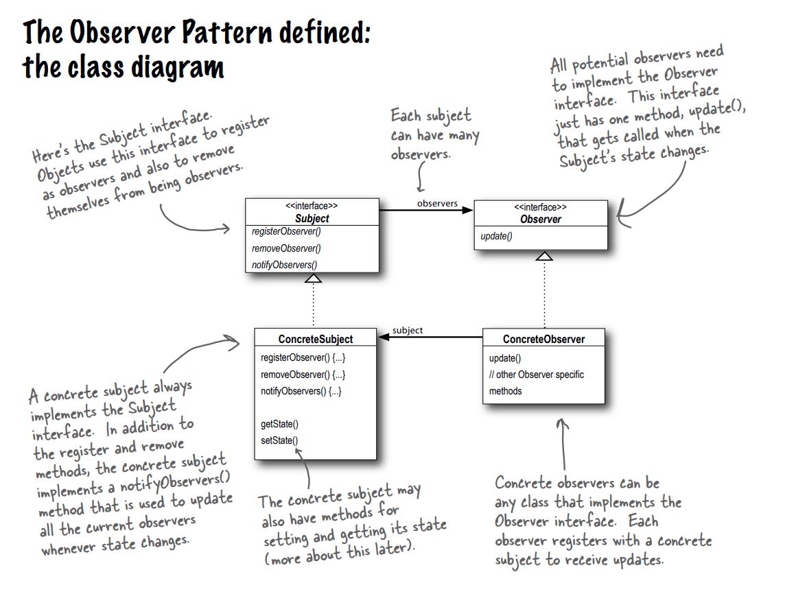

The Observer Pattern defines a one-to-many dependency between objects so that when one
object changes state, all its dependents are notified and updated automatically.

### The power of Loose Coupling

Strive for loosely coupled designs between objects that interact.

* When two objects are loosely coupled, they can interact,
but have very little knowledge of each other.
* The Observer Pattern provides an object design where
subjects and observers are loosely coupled.

### Why?
* **The only thing the subject knows about an observer is that it
implements a certain interface (the Observer interface).** It doesn’t need to
know the concrete class of the observer, what it does, or anything else about it.
* **We can add new observers at any time.** Because the only thing the subject
depends on is a list of objects that implement the Observer interface, we can add new
observers whenever we want. In fact, we can replace any observer at runtime with
another observer and the subject will keep purring along. Likewise, we can remove
observers at any time.
* **We never need to modify the subject to add new types of observers.** Let’s
say we have a new concrete class come along that needs to be an observer. We don’t
need to make any changes to the subject to accommodate the new class type, all
we have to do is implement the Observer interface in the new class and register as
an observer. The subject doesn’t care; it will deliver notifications to any object that
implements the Observer interface.
* **We can reuse subjects or observers independently of each other.** If we
have another use for a subject or an observer, we can easily reuse them because the
two aren’t tightly coupled.
* **Changes to either the subject or an observer will not affect the other.**
Because the two are loosely coupled, we are free to make changes to either, as long as
the objects still meet their obligations to implement the subject or observer interfaces.
