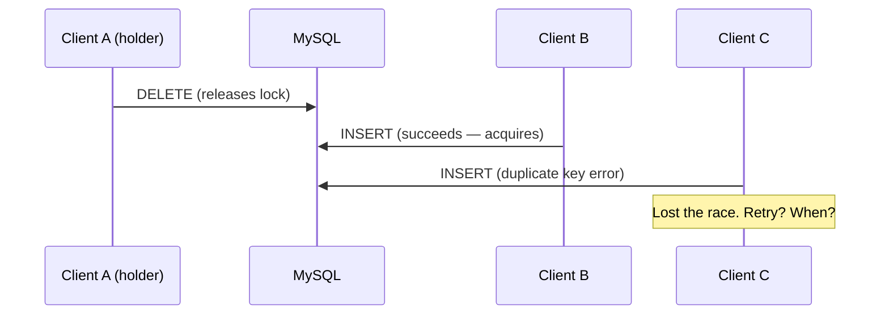
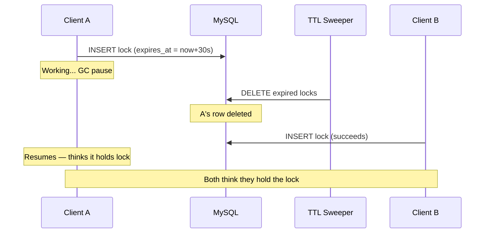
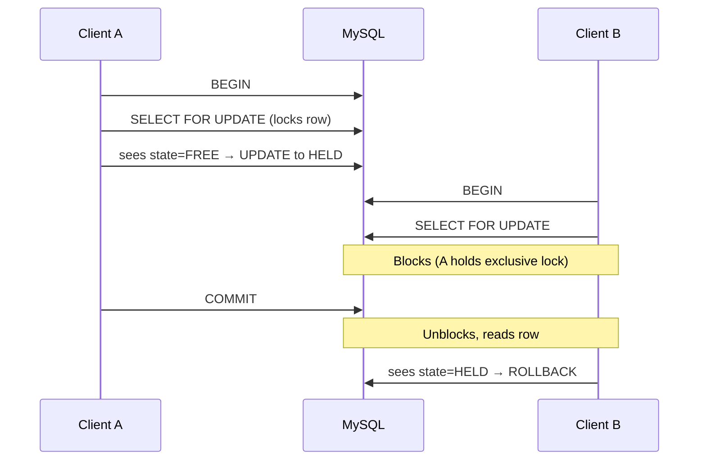
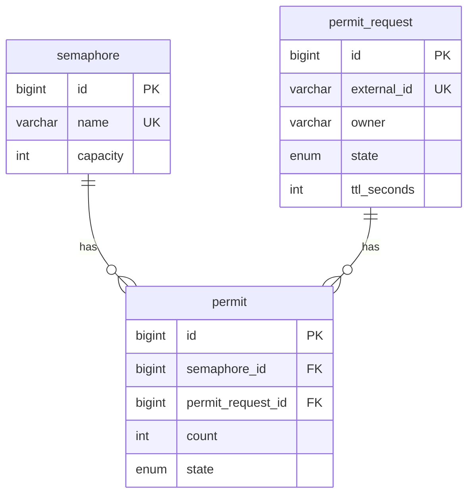
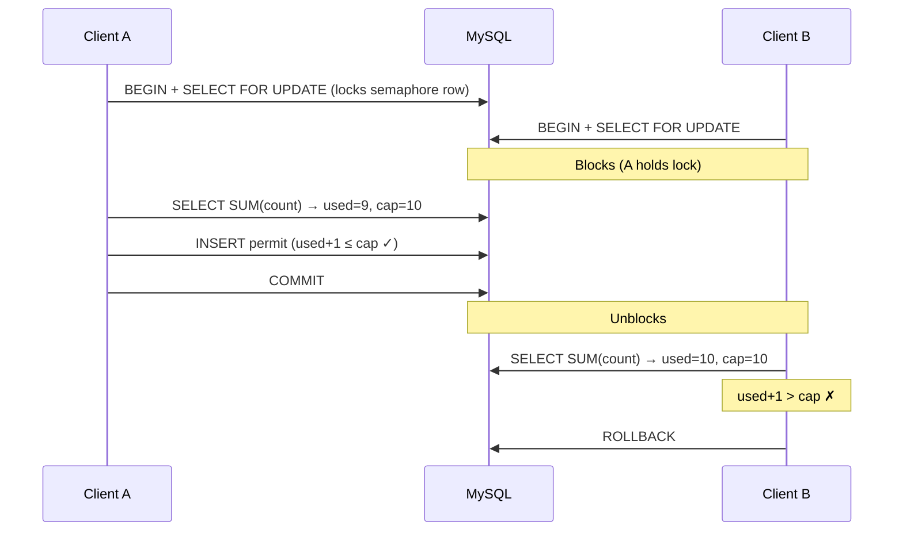
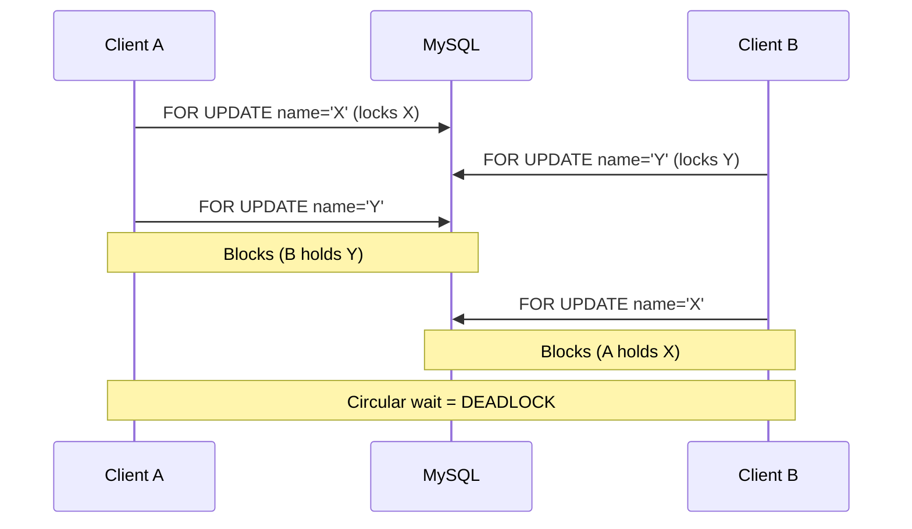
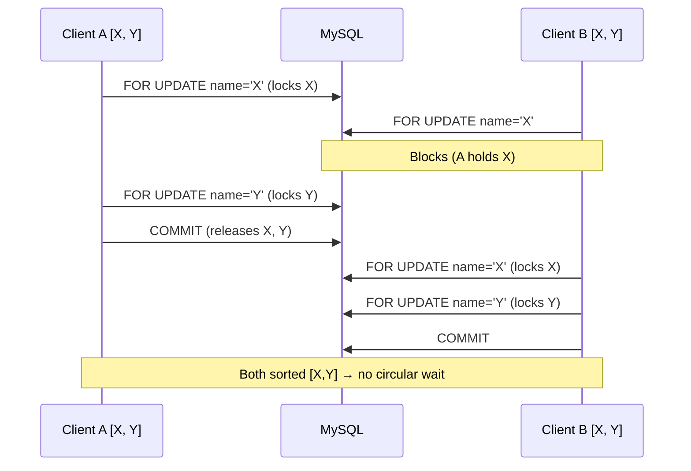
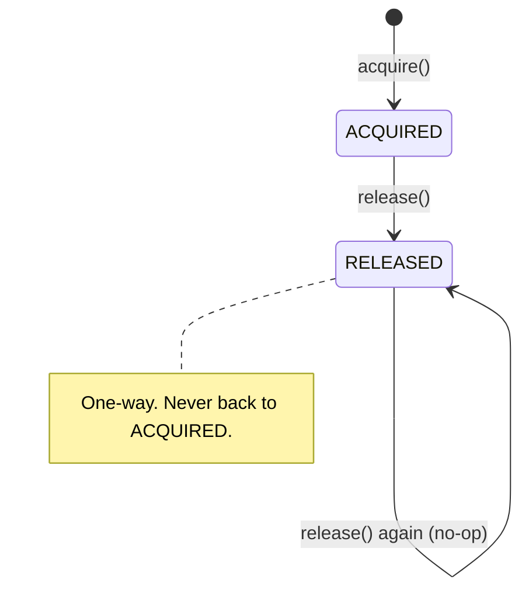
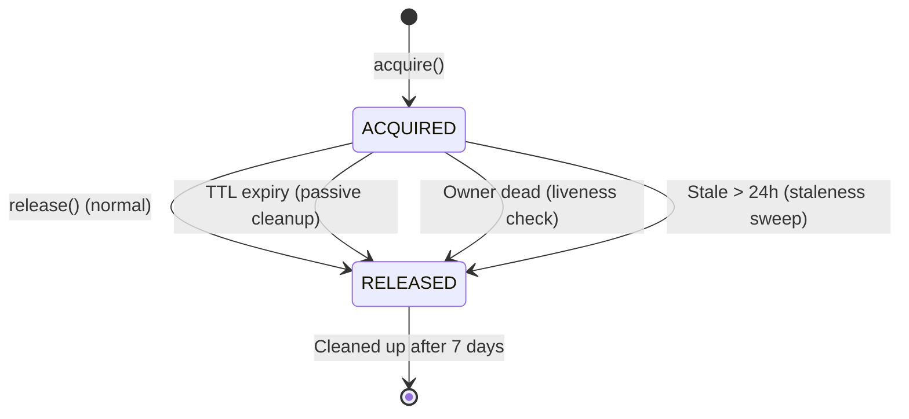
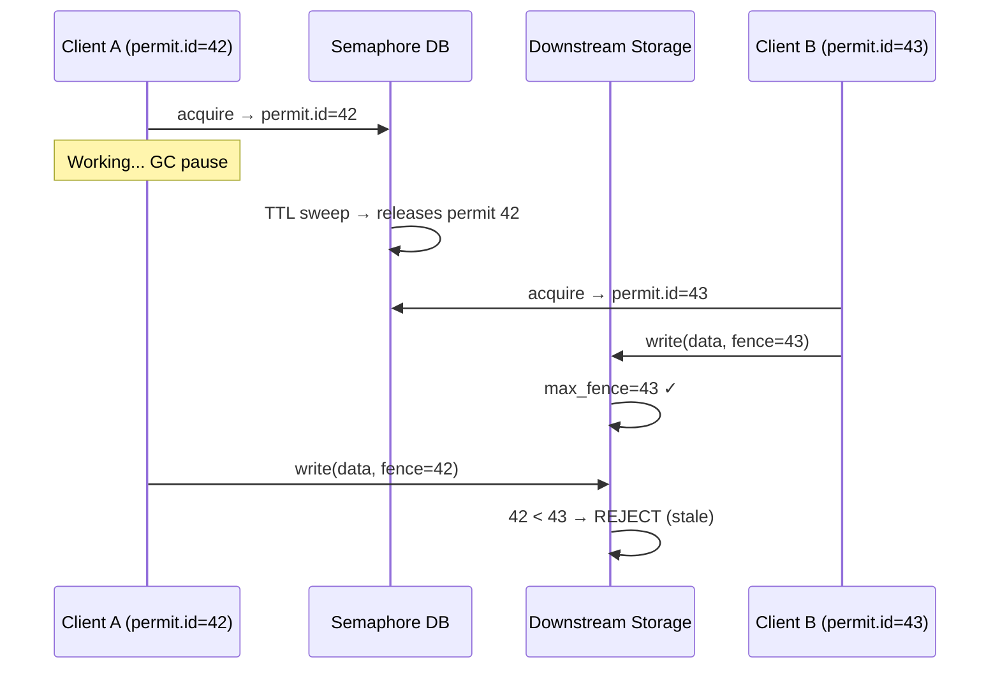

# Distributed Counting Semaphore with MySQL

Notes on building a distributed counting semaphore from scratch using MySQL. 
* Starts with the simplest possible thing, breaks it, fixes it, and repeats until we arrive at a working design.

---

## Part 1: The Problem

In a single process, limiting concurrency is trivial:

```python
sem = threading.Semaphore(10)  # max 10 concurrent
sem.acquire()
do_work()
sem.release()
```

But when services run across multiple machines, they don't share memory. A process on Machine A has no idea what Machine B is doing. We need something external that all machines can agree on.

**Options:**
- **Redis** — fast, in-memory, `SET NX EX` for simple locks. But no transactional multi-resource acquire and safety depends on timing assumptions (see Kleppmann's critique below).
- **ZooKeeper/etcd** — true consensus, ephemeral nodes handle crash recovery automatically. But requires dedicated infrastructure.
- **Your existing MySQL** — already there, ACID transactions, row-level locking. No new infrastructure. That's what we'll use.

---

## Part 2: Start Simple — A Distributed Mutex

Before counting semaphores, let's build the simplest thing: a binary mutex (only 1 holder at a time).

### Attempt 1: Naive INSERT

```sql
CREATE TABLE lock_table (
    name    VARCHAR(255) PRIMARY KEY,
    holder  VARCHAR(255) NOT NULL
);
```

To acquire: `INSERT INTO lock_table (name, holder) VALUES ('my-lock', 'client-A');`
To release: `DELETE FROM lock_table WHERE name = 'my-lock' AND holder = 'client-A';`

If the INSERT fails with duplicate key, the lock is held by someone else.

**What breaks:**
- Client crashes → row stays forever → lock never released. **Permanent resource leak** — no other client can ever acquire, even though nobody holds the lock.
- No way to wait — you just get an error and have to poll.
- Race on release: A deletes its row, B and C both try to INSERT simultaneously — one wins, the other gets a duplicate key error. The loser has no way to distinguish "someone else acquired" from a transient failure.



### Attempt 2: Add TTL

```sql
CREATE TABLE lock_table (
    name        VARCHAR(255) PRIMARY KEY,
    holder      VARCHAR(255) NOT NULL,
    expires_at  TIMESTAMP NOT NULL
);
```

Acquire: insert with `expires_at = NOW() + interval`. A background sweeper deletes expired rows.

**Better, but still breaks:**
- Client A's lock expires while it's still doing work (GC pause, slow network). Client B acquires. Both think they hold the lock. This is exactly the problem Kleppmann describes — **you cannot rely on timing for correctness**.
- The check-then-act race still exists.



### Attempt 3: SELECT FOR UPDATE

The root problem with Attempts 1-2: they use **row presence/absence** as the locking mechanism. INSERT and DELETE aren't designed for mutual exclusion — they're just data operations that happen to fail on duplicates. What if the row always exists, and we use the database's actual locking primitive to protect it?

```sql
CREATE TABLE mutex (
    name    VARCHAR(255) PRIMARY KEY,
    holder  VARCHAR(255),
    state   ENUM('FREE', 'HELD') NOT NULL DEFAULT 'FREE'
);

-- Pre-create the mutex row
INSERT INTO mutex (name, state) VALUES ('my-lock', 'FREE');
```

Acquire:
```sql
START TRANSACTION;
SELECT * FROM mutex WHERE name = 'my-lock' FOR UPDATE;  -- blocks other acquirers
-- Application checks: if state = 'FREE', then:
UPDATE mutex SET state = 'HELD', holder = 'client-A'
WHERE name = 'my-lock' AND state = 'FREE';
-- Check rows affected: 0 = lock was HELD → ROLLBACK, 1 = acquired
COMMIT;
```

Release:
```sql
UPDATE mutex SET state = 'FREE', holder = NULL WHERE name = 'my-lock';
```

**What this fixes vs Attempt 2:**

**Check-then-act race → fixed.** In Attempts 1-2, "check if row exists, then INSERT" is two separate operations — another client can slip in between. With `SELECT FOR UPDATE`, the check (is state FREE?) and the update (set to HELD) happen inside one transaction, and the exclusive row lock prevents anyone else from even reading the row until you commit.

**Blocking instead of failing.** In Attempts 1-2, a contending client gets a duplicate key error and has to poll. With `SELECT FOR UPDATE`, the second client **blocks** until the first commits — the database acts as a natural queue.



**What this does NOT fix:**

**TTL misfire is still a safety problem.** We still need TTL for crash recovery (client crashes → state stays HELD forever). But TTL can still fire too early:

1. Client A holds the lock but is slow (GC pause, network delay)
2. TTL sweep sets state back to `FREE`
3. Client B does `SELECT FOR UPDATE`, sees `FREE`, acquires
4. Client A resumes — both think they hold the lock

`SELECT FOR UPDATE` prevents the **race** (two clients checking simultaneously), but can't prevent TTL from pulling the rug out from under a slow holder. This is the same fundamental problem as Attempt 2 — timing can't guarantee correctness.

This requires a **fencing token** to solve completely — a monotonically increasing ID passed to the downstream resource, which rejects writes from stale holders. We'll address this in Part 6.

**Also still limited:** only supports 1 holder. We want N concurrent holders (counting semaphore).

**Key insight:** `SELECT FOR UPDATE` is the fundamental building block. It fixes the race condition and the check-then-act problem. Everything below builds on it.

---

## Part 3: From Mutex to Counting Semaphore

A mutex allows 1 holder. A counting semaphore allows N. Instead of checking `state = FREE`, we count how many permits are currently held and compare against capacity.

### Schema

```sql
CREATE TABLE semaphore (
    id          BIGINT UNSIGNED AUTO_INCREMENT PRIMARY KEY,
    name        VARCHAR(255) NOT NULL UNIQUE,
    capacity    INT NOT NULL,
    created_at  TIMESTAMP DEFAULT CURRENT_TIMESTAMP,
    updated_at  TIMESTAMP DEFAULT CURRENT_TIMESTAMP ON UPDATE CURRENT_TIMESTAMP
);

CREATE TABLE permit_request (
    id          BIGINT UNSIGNED AUTO_INCREMENT PRIMARY KEY,
    external_id VARCHAR(255) NOT NULL UNIQUE,   -- client-provided idempotency key
    owner       VARCHAR(255),
    state       ENUM('ACQUIRED', 'RELEASED') NOT NULL,  -- no PENDING/WAITING: see note below
    ttl_seconds INT,
    created_at  TIMESTAMP DEFAULT CURRENT_TIMESTAMP,
    updated_at  TIMESTAMP DEFAULT CURRENT_TIMESTAMP ON UPDATE CURRENT_TIMESTAMP
);

CREATE TABLE permit (
    id                  BIGINT UNSIGNED AUTO_INCREMENT PRIMARY KEY,
    semaphore_id        BIGINT UNSIGNED NOT NULL REFERENCES semaphore(id),
    permit_request_id   BIGINT UNSIGNED NOT NULL REFERENCES permit_request(id),
    count               INT NOT NULL DEFAULT 1,
    state               ENUM('ACQUIRED', 'RELEASED') NOT NULL,
    INDEX idx_semaphore_state (semaphore_id, state),
    INDEX idx_request (permit_request_id)
);
```

**No PENDING or WAITING state:** This is intentional. The design doesn't support queued/blocking acquisition — if there's no capacity, the acquire fails immediately (or blocks briefly at the DB lock level). If you need a waiting queue, you'd add a `PENDING` state and a notification mechanism, but that adds significant complexity. Failing fast and letting the caller retry is simpler and sufficient for most use cases.

The `idx_semaphore_state` index is critical — without it, `SELECT SUM(count) FROM permit WHERE semaphore_id = ? AND state = 'ACQUIRED'` does a full table scan on every acquire.



**Why 3 tables instead of 1?**

A single acquire can span **multiple semaphores** atomically — "I need 1 backup slot AND 1 network slot." The `permit` table is the many-to-many join between requests and semaphores. `permit_request` tracks the overall lifecycle. `semaphore` defines capacity.

This also means you can query utilization per semaphore independently.

### The external_id (Idempotency Key)

The `external_id` on `permit_request` is **client-provided**, not server-generated. The caller decides what to pass based on their operation:

- A background job uses its **job ID**: `"job-abc-123"`
- A job holding permits for multiple snapshots uses a **composite key**: `"job-abc-123::snapshot-456"`
- Any caller can use a **UUID** they generate: `"550e8400-e29b-41d4-a716-446655440000"`

The service doesn't care what the string is — it just enforces uniqueness. This is what makes retries safe: the caller knows their own operation ID and can call acquire again with the same key without risk of double-granting.

> **Note:** Do not confuse this idempotency key with a **fencing token**. The `external_id` protects the *lock database* from double-granting on retries. It does not protect *downstream resources* from stale writes if a TTL expires while the client is still working. For that, you'd use the auto-incrementing `permit.id` as a monotonically increasing fencing token passed to the storage layer (see Part 6).

---

## Part 4: Acquire — Building It Up

### The naive version (broken)

```sql
SELECT SUM(count) AS used FROM permit
WHERE semaphore_id = 1 AND state = 'ACQUIRED';

-- Application checks: if used + requested <= capacity, then:
INSERT INTO permit_request (...) VALUES (...);
INSERT INTO permit (...) VALUES (...);
```

**Race condition:** Two clients read `used = 9` simultaneously, both see room for 1 more (capacity = 10), both insert. Now 11 permits are held. The read and write are not atomic.

### Fix 1: SELECT FOR UPDATE

Lock the semaphore row before reading:

```sql
START TRANSACTION;
SELECT id, capacity FROM semaphore WHERE name = 'backup-slots' FOR UPDATE;
-- Now this row is exclusively locked. Other transactions block here.

SELECT SUM(count) AS used FROM permit
WHERE semaphore_id = 1 AND state = 'ACQUIRED';

-- Check: used + requested <= capacity
-- If yes:
INSERT INTO permit_request ...;
INSERT INTO permit ...;
COMMIT;
-- If no:
ROLLBACK;
```

Now the second client blocks on `SELECT FOR UPDATE` until the first commits. When it unblocks, it reads the updated count and correctly sees no room.



### Fix 2: Multi-semaphore acquire — the deadlock problem

What if we need to acquire from multiple semaphores atomically?

```sql
-- Request A wants [X, Y]
SELECT ... FROM semaphore WHERE name = 'X' FOR UPDATE;  -- locks X
SELECT ... FROM semaphore WHERE name = 'Y' FOR UPDATE;  -- locks Y

-- Request B wants [Y, X]
SELECT ... FROM semaphore WHERE name = 'Y' FOR UPDATE;  -- locks Y
SELECT ... FROM semaphore WHERE name = 'X' FOR UPDATE;  -- blocks forever (A holds X)
```

A holds X, waits for Y. B holds Y, waits for X. **Deadlock.**



**Fix: sort semaphore names before locking.** Both requests lock X first, then Y. One waits, the other proceeds. No circular dependency. This is the classic [lock ordering](https://en.wikipedia.org/wiki/Deadlock_prevention_algorithms#Lock_ordering) technique.



**InnoDB deadlock detection:** Even with sorted locking, InnoDB actively detects deadlocks (e.g., from gap locks or other edge cases) and automatically aborts one of the transactions. This makes the retry loop in Fix 4 not just a good idea, but **mandatory** — your code must handle `ER_LOCK_DEADLOCK` gracefully.

Also set a short lock wait timeout to fail fast under contention:

```sql
SET SESSION innodb_lock_wait_timeout = 5;  -- vs default 50 seconds
```

**Isolation level note:** MySQL/InnoDB defaults to `REPEATABLE READ`. A subtle but critical detail: `SELECT FOR UPDATE` does **not** use the MVCC snapshot — it reads the **latest committed version** of the row, even under `REPEATABLE READ`. This is how it can see permits inserted by a transaction that committed while we were waiting for the lock. The stability guarantee comes from the exclusive lock itself (no concurrent writer can modify the row while we hold it), not from the snapshot. This trips people up — a regular `SELECT` under `REPEATABLE READ` would see the stale snapshot, but `SELECT FOR UPDATE` always reads current data.

### Fix 3: Retries — the duplicate problem

Network blip. Client sends acquire, server processes it, response gets lost. Client retries.

Without protection: two permits granted for the same operation. **Double-acquire.**

**Fix: idempotency check before doing anything.**

```sql
SELECT id, state FROM permit_request WHERE external_id = 'req-abc-123';
-- If found → return existing state, done.
```

The `UNIQUE` constraint on `external_id` is the last line of defense. Even if two concurrent requests slip past the initial check (read `NULL`, both try to INSERT), the second INSERT fails with a duplicate key error. The service catches this, re-fetches the existing row, and returns its state.

### Fix 4: Wrap it in retry-able transaction

Transient DB errors (deadlock detected, connection reset) should retry automatically. Up to 3 attempts:

- Failed before commit → nothing written, retry is fresh start
- Committed but response lost → retry hits idempotency check, returns existing result

### The complete acquire

Putting all fixes together:

```
1. Idempotency check (SELECT by external_id)
2. Sort semaphore names
3. [Optional] Acquire in-memory pre-locks
4. BEGIN TRANSACTION (with retry, max 3)
   a. SET innodb_lock_wait_timeout = 5
   b. SELECT FOR UPDATE on each semaphore (sorted order)
   c. SUM currently acquired permits
   d. Check availability — if any exhausted → ROLLBACK
   e. INSERT permit_request + INSERT permits
   f. Reset lock wait timeout to default
5. COMMIT
```

---

## Part 5: Release — Why It's Simpler

### The release flow

```sql
-- 1. Load the request
SELECT id, state FROM permit_request WHERE external_id = 'req-abc-123';

-- 2. If ACQUIRED:
UPDATE permit SET state = 'RELEASED'
WHERE permit_request_id = @request_id AND state != 'RELEASED';

UPDATE permit_request SET state = 'RELEASED'
WHERE id = @request_id;

-- 3. If already RELEASED: return ALREADY_RELEASED, no writes.
```

### Why release doesn't need SELECT FOR UPDATE

Acquire needs `SELECT FOR UPDATE` because multiple writers contend over a shared count. Release has no contention — it only touches rows belonging to this specific request.

### Why release doesn't need a transaction

The two UPDATEs are deliberately NOT wrapped in a transaction:

1. **One-way state machine.** `ACQUIRED → RELEASED` only. Never back. No race over direction.
2. **Idempotent WHERE clause.** `AND state != 'RELEASED'` — running the same release twice matches zero rows the second time.
3. **Crash between the two UPDATEs.** Permits say RELEASED, request still says ACQUIRED. The **orphan cleanup mechanism** (Part 6) detects this inconsistency during its periodic sweep — it calls release again, the permit UPDATE is a no-op (already RELEASED), and the request UPDATE succeeds. Consistency restored eventually.

No locking. No transaction. The one-way state machine + idempotent updates + eventual cleanup make this safe.



Compare this to ZooKeeper's approach: ephemeral nodes auto-delete when the session dies. Here, we get the same effect through the one-way state machine + background cleanup — it's just not instant.

---

## Part 6: The Leaked Permit Problem

The hardest problem in distributed locking: client acquires, then crashes. Nobody calls release.

Redis solves this with TTL auto-expiry on keys. ZooKeeper solves it with ephemeral nodes tied to sessions. Both are immediate (or near-immediate). Our MySQL approach uses **passive cleanup** — it's not instant, but it's correct.

### Three cleanup mechanisms

**a) TTL expiry** — client sets a TTL when acquiring. Background sweep every ~5 minutes:

```sql
SELECT id, external_id, created_at, ttl_seconds
FROM permit_request
WHERE state = 'ACQUIRED'
  AND ttl_seconds IS NOT NULL;
```
For each: if `now() - created_at > ttl_seconds` → release it.

Not real-time (max ~5 min delay). Fine for long-running operations (backups, exports). Not suitable if you need sub-second expiry — use Redis for that.

**b) Owner liveness check** — for permits owned by background jobs, query the job orchestrator: "Is this job still running?" Dead job → release its permits.

**c) Staleness sweep** — any ACQUIRED request older than a threshold (e.g. 24h) → release.



### Why passive TTL is actually fine

Kleppmann's core argument against Redlock: you can't use timing for **correctness**. A lock that expires before work completes leads to two holders.

Our design treats TTL as a **cleanup mechanism**, not a correctness mechanism. `SELECT FOR UPDATE` provides mutual exclusion during acquisition. TTL just prevents permanent leaks from crashed clients.

**But what if TTL fires while the client is still working?** Two clients can genuinely hold permits simultaneously. The semaphore service alone cannot prevent this — it's a fundamental limitation of any TTL-based system.

To fully solve this, the **downstream resource** must participate. The auto-incrementing `permit.id` can serve as a **fencing token**: the client passes it to the storage layer on every write, and the storage layer rejects writes with an ID lower than the highest it has seen. This way, even if a stale client resumes after TTL expiry, its writes are rejected.



Without fencing, the semaphore provides **efficiency** (limiting concurrency) but not **safety** (preventing stale writes). With fencing, you get both.

---

## Part 7: Performance — In-Memory Pre-Lock

Under high contention, `SELECT FOR UPDATE` queues transactions at the DB level. Each holds a DB connection while blocked. This wastes connection pool.

**Optimization:** before hitting the DB, acquire an in-memory named lock per semaphore within the service process:

```
Without:  10 concurrent requests → 10 DB transactions queuing on row lock
With:     10 concurrent requests → 1 hits DB, 9 wait in-memory (no connection held)
```

Properties:
- Per-semaphore granularity — different semaphores proceed in parallel
- 5s timeout — fail fast
- Purely optional — correctness from DB layer only. Multi-instance deployments rely on the DB for cross-instance serialization.
- Auto-released via deferred cleanup on transaction completion

---

## Part 8: Maintenance

| Task | Frequency | Action |
|------|-----------|--------|
| Orphan release | Every 5 mins | Release dead owner and TTL-expired permits |
| Request cleanup | Every 4 hours | Delete released requests older than 7 days |
| History cleanup | Every 24 hours | Delete capacity-change audit records older than 30 days |

Old request cleanup uses **batched deletes** (~800 rows/batch) to avoid long transactions that block production traffic. Fetch batch → delete permits → delete requests → repeat.

---

## Summary: How Each Problem Gets Solved

| Problem | Naive approach | What breaks | Fix |
|---------|---------------|-------------|-----|
| Concurrent access | No locking | Race condition on count | `SELECT FOR UPDATE` |
| Multi-resource acquire | Lock in arbitrary order | Deadlock | Sort names → lock ordering |
| Network retry | No dedup | Double-acquire | `external_id` UNIQUE constraint |
| Partial failure | Separate statements | Some permits granted, some not | Single transaction |
| Client crash | Nothing | Permit leaked forever | TTL + owner liveness + staleness sweep |
| Timing-based expiry | TTL as lock mechanism | Two holders after expiry | Fencing token on downstream resource |
| DB contention | All requests hit DB | Connection pool exhaustion | In-memory pre-lock |
| DB transient failure | No retry | Operation lost | Retry + idempotency makes it safe |

---

## Design Patterns

| Pattern | Purpose |
|---------|---------|
| Idempotency key (`external_id`) | Safe retries, no double-acquire |
| Fencing token (`permit.id`) | Prevent stale writes to downstream resources after TTL expiry |
| Sorted lock ordering | Deadlock prevention |
| `SELECT FOR UPDATE` | Mutual exclusion across distributed clients |
| Single transaction for acquire | All-or-nothing multi-semaphore acquire |
| One-way state machine | Idempotent release without locking |
| Passive TTL sweep | Leaked permit recovery without per-permit timers |
| In-memory pre-lock | Reduced DB contention under high load |
| Transaction retry + idempotency | Tolerance for transient DB failures |
| Batched deletes | Maintenance without blocking production traffic |

---

## When to Use

**Good fit:**
- Counting semaphore (not just binary mutex)
- Multi-process/multi-machine coordination
- Already have MySQL/PostgreSQL — no new infrastructure
- Need atomic multi-semaphore acquire
- Need durability (permits survive restarts)
- Can tolerate passive TTL (minutes, not milliseconds)

**Not a good fit:**
- Sub-second lock expiry → Redis `SET NX EX`
- Leader election → ZooKeeper/etcd
- Microsecond latency on lock path
- No existing relational DB

---

## Core Primitives

All correctness comes from five things:

1. `SELECT FOR UPDATE` — exclusive row locks for mutual exclusion
2. `UNIQUE` constraint — duplicate detection for idempotency
3. Transactions — atomic multi-table writes for all-or-nothing
4. Sorted lock acquisition — deadlock prevention
5. One-way state machine — safe concurrent releases without locking

---

## References & Related Work

### Distributed Locking Theory
- [How to do distributed locking — Martin Kleppmann](https://martin.kleppmann.com/2016/02/08/how-to-do-distributed-locking.html) — Canonical critique of distributed locking algorithms. Key insight: timing-based locks (TTL expiry) cannot guarantee correctness. Introduces fencing tokens — monotonically increasing IDs that the **downstream storage** uses to reject stale writes. Note: our `external_id` is an idempotency key (prevents double-grants on retries), not a fencing token. To implement fencing, you'd pass the auto-incrementing `permit.id` to the downstream resource, which must reject writes with an ID lower than the highest it has seen.
- [Distributed Locking: A Practical Guide — Architecture Weekly](https://www.architecture-weekly.com/p/distributed-locking-a-practical-guide) — Practical comparison of distributed locking approaches: Redis `SET NX EX`, ZooKeeper ephemeral nodes, DB-based `SELECT FOR UPDATE`, PostgreSQL advisory locks, and Kubernetes single-instance pattern. Good overview of trade-offs between the approaches discussed here.

### SQL-Based Locking Primitives
- [MySQL InnoDB Locking Reads (`SELECT FOR UPDATE`)](https://dev.mysql.com/doc/refman/8.0/en/innodb-locking-reads.html) — Official docs on the core primitive this design uses. Covers exclusive vs shared locks and interaction with transaction isolation levels.
- [PostgreSQL Advisory Locks](https://www.postgresql.org/docs/current/explicit-locking.html) — PostgreSQL's alternative: lightweight application-defined locks that don't require a dedicated table. Simpler but less durable (session-scoped).

### Libraries & Tools
- [ShedLock](https://github.com/lukas-krecan/ShedLock) — Java library for distributed task locking using a DB table. Same pattern (lock table + TTL-based expiry) but limited to binary mutex for scheduled tasks. Good reference for a minimal implementation.

### Alternative Approaches
- [Redis Distributed Locks (Redlock)](https://redis.io/docs/latest/develop/use/patterns/distributed-locks/) — Redis's approach: `SET NX EX` with majority quorum across N instances. Better for sub-second TTLs. Limitations: depends on clock synchronization, no transactional multi-resource acquire, no consensus algorithm. Kleppmann argues it's unsafe for correctness-critical locks.
- [ZooKeeper Recipes: Locks](https://zookeeper.apache.org/doc/current/recipes.html) — Uses sequential ephemeral znodes. Elegant: ephemeral nodes auto-delete on session death (instant crash recovery, unlike our passive cleanup). Sequential ordering avoids herd effect (each waiter watches only the next-lower node). Downside: requires dedicated ZK infrastructure.
