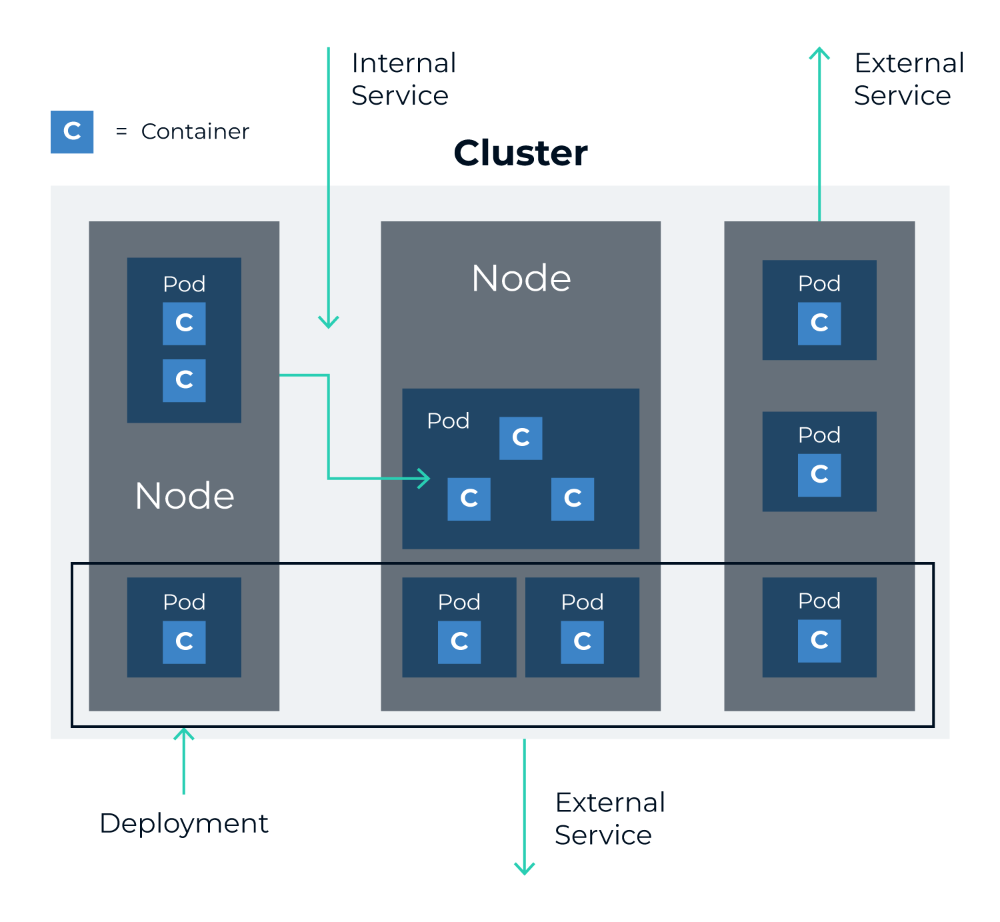
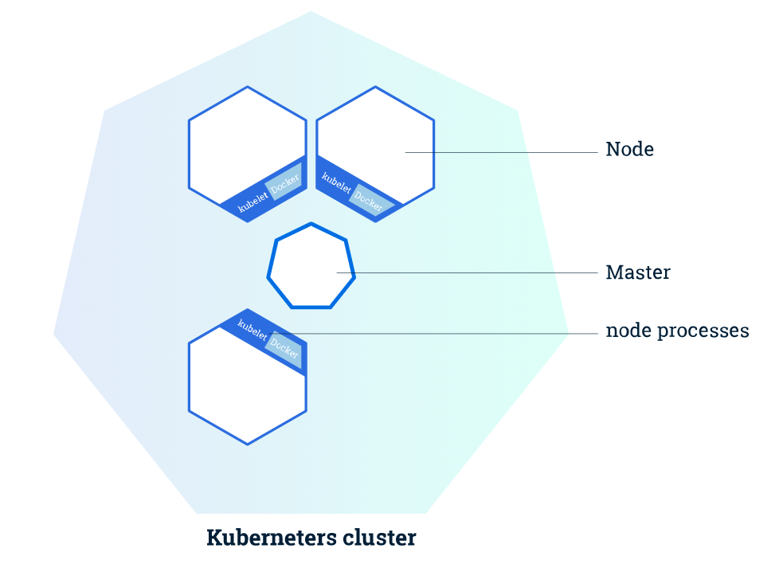
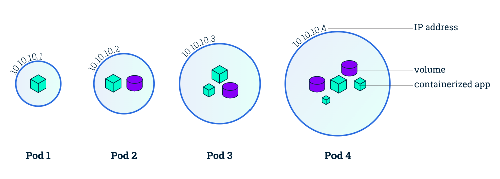
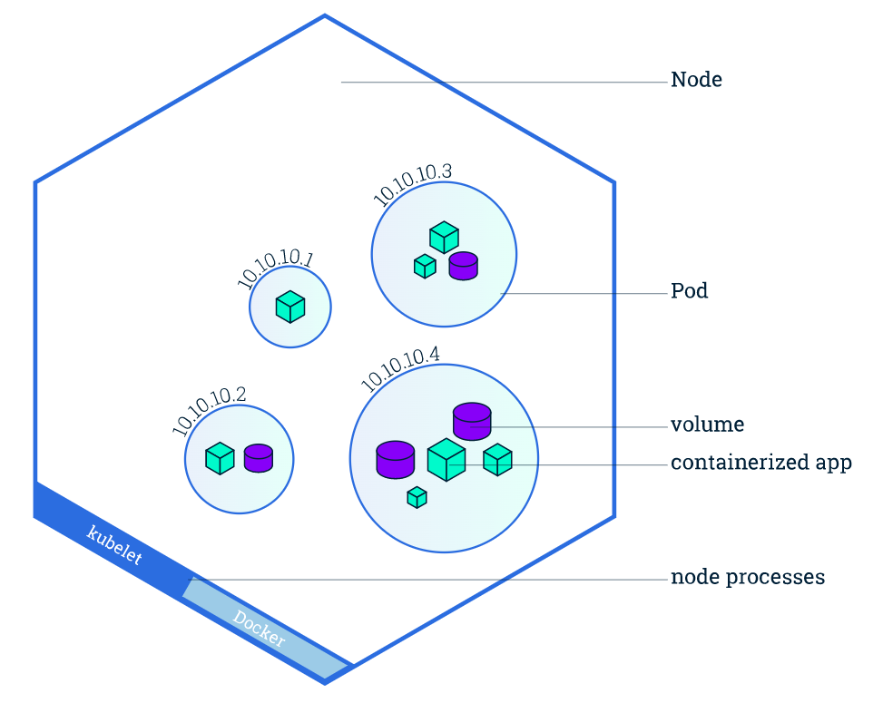
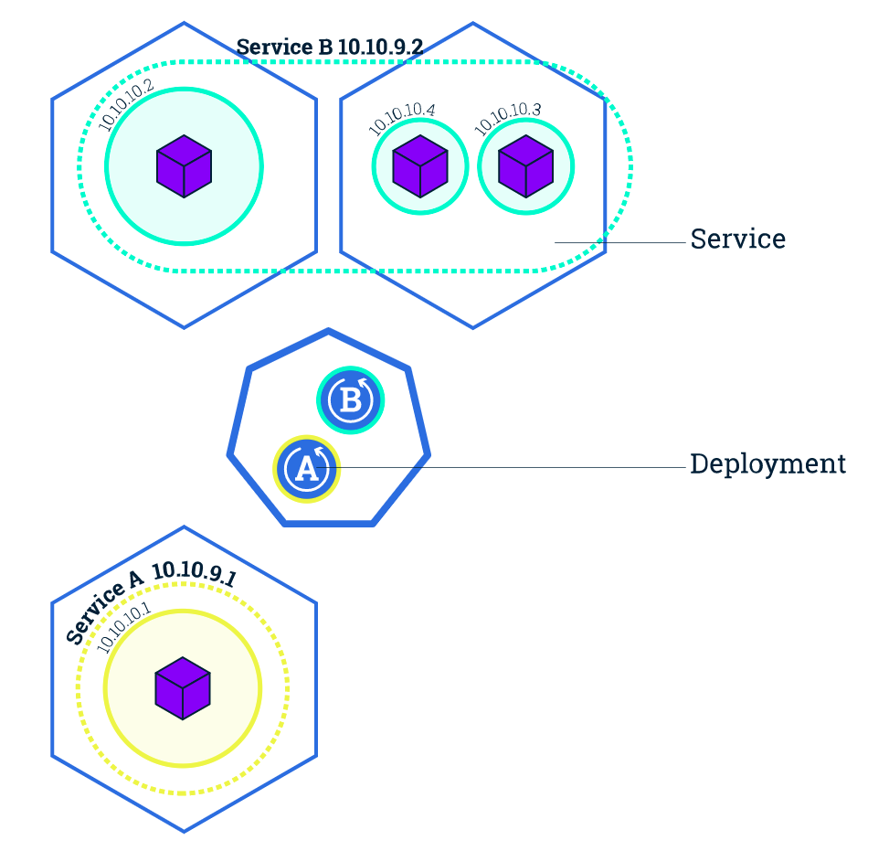
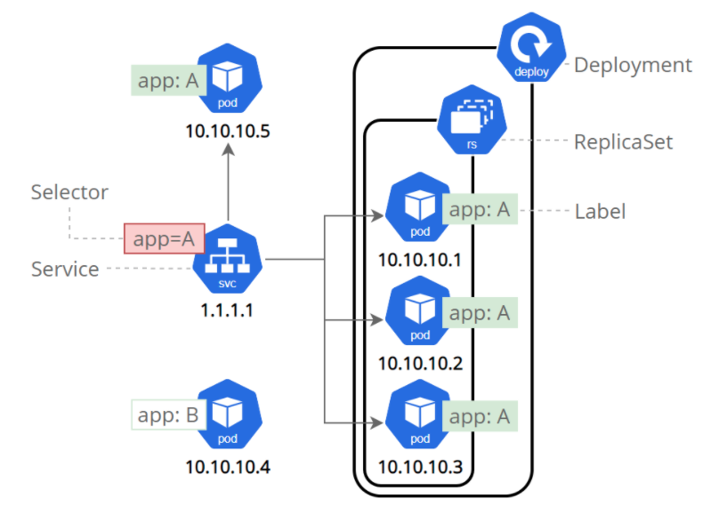
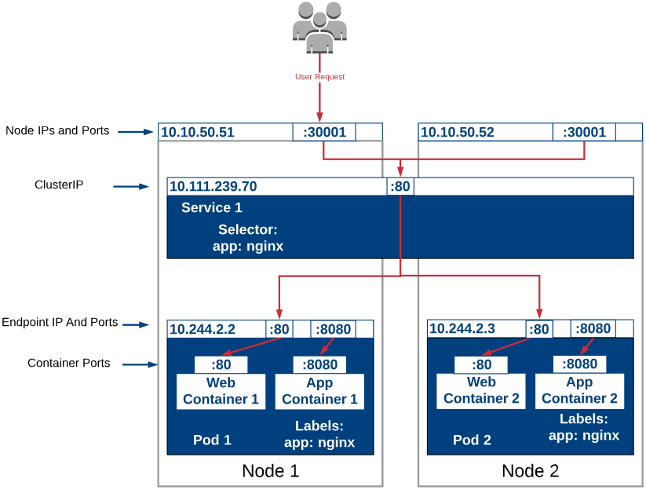
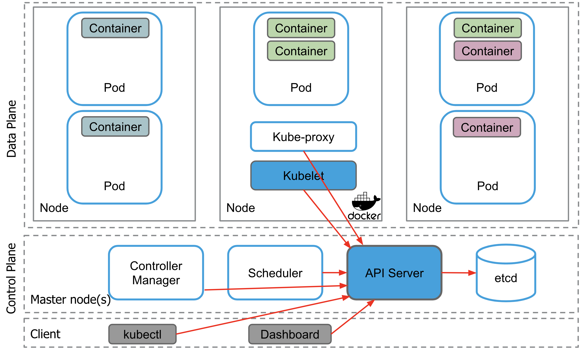
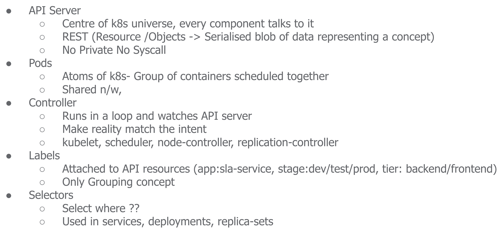
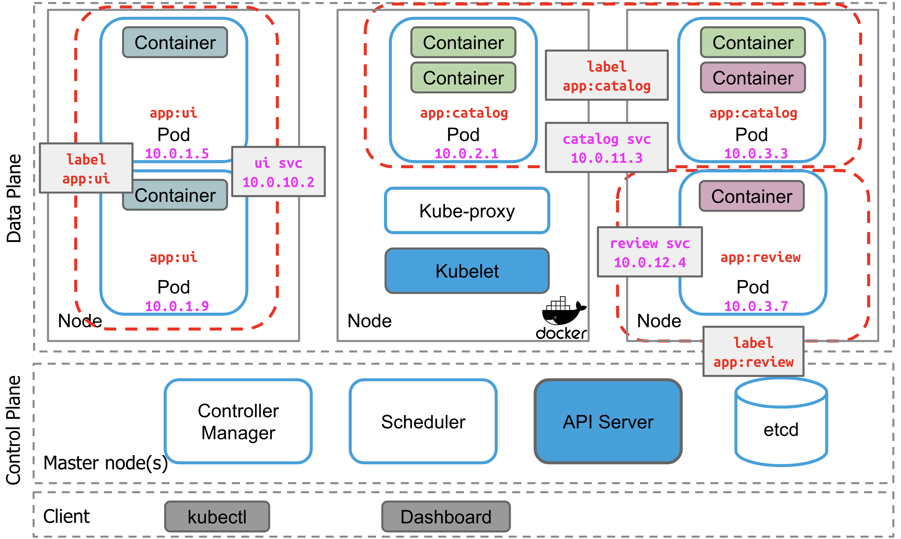

Terms with which you should be familiar:

* Cluster – Group of physical or virtual servers wherein  Kubernetes is installed. A set of worker machines, called nodes, that run containerized applications. Every cluster has at least one worker node.
* Node (Master) – Physical or virtual server that **controls** the Kubernetes cluster
* Node (Worker) – Physical or virtual servers where  **workloads run** in a given container technology 
* Pods – A pod is the **smallest unit** in a Kubernetes cluster. A pod may contain one or more containers. Group of containers and volumes which share the same network namespace 
* Labels – User defined **Key:Value pair** associated to Pods  
* Master – Control plane components which provide access  point for admins to manage cluster workloads 
* Service – An abstraction which serves as a proxy for a group of Pods performing a “service”

### Cluster

Masters manage the cluster and the nodes are used to host the running applications.

### Deployment

A Deployment is responsible for creating and updating instances of your application. 
After creating application instances, a Deployment Controller continuously watches them, and replaces an instance if the 
Node hosting it goes down or it is deleted. This provides a self-healing mechanism to address machine failure and machine maintenance.

Deployments -> Replicasets -> Pods

### Pod

A Pod is a group of one or more application containers (such as Docker or rkt) and includes shared storage (volumes), 
IP address and information about how to run them. Pods always run on Nodes.

Containers should only be scheduled together in a single Pod if they are tightly coupled and need to share resources such as disk.

Kubernetes gives every pod its own cluster-private IP address, so you do not need to explicitly create links between pods or map container ports to host ports. This means that **containers within a Pod can all reach each other's ports on localhost**, and all pods in a cluster can see each other without NAT.

Pods are scaled up and down as a unit, **all containers in a pod must scale together**, regardless of their individual needs.

### Node

A node is a worker machine in Kubernetes and may be a VM or physical machine, depending on the cluster. Multiple Pods can run on one Node.

### Service

While Pods do have their own unique IP across the cluster, those IP’s are not exposed outside Kubernetes. Taking into account that over time Pods may be terminated, deleted or replaced by other Pods, we need a way to let other Pods and applications automatically discover each other. Kubernetes addresses this by grouping Pods in Services. A Kubernetes Service is an **abstraction layer which defines a logical set of Pods and enables external traffic exposure**, load balancing and service discovery for those Pods.

This abstraction will allow us to **expose Pods to traffic originating from outside the cluster**. Services have their own unique cluster-private IP address and expose a port to receive traffic. If you choose to expose the service outside the cluster, the options are:
* LoadBalancer - provides a public IP address (what you would typically use when you run Kubernetes on GKE or AWS)
* NodePort - exposes the Service on the same port on each Node of the cluster using NAT (available on all Kubernetes clusters, and in Minikube)

A Kubernetes Service is an abstraction layer which defines a **logical set of Pods** and enables external traffic exposure, load balancing and service discovery for those Pods.

  
Services match a set of Pods using labels and selectors, a grouping primitive that allows logical operation on objects in Kubernetes.

Services allow your applications to receive traffic. Services can be exposed in different ways by specifying a type in the ServiceSpec:

* `ClusterIP` (default) - Exposes the Service on an internal IP in the cluster. This type makes the Service only reachable from within the cluster.
* `NodePort` - Exposes the Service on the same port of each selected Node in the cluster using NAT. Makes a Service accessible from outside the cluster using `<NodeIP>:<NodePort>`, You can only use ports 30000–32767. Superset of ClusterIP.
* `LoadBalancer` - Creates an external load balancer in the current cloud (if supported) and assigns a fixed, external IP to the Service. Superset of NodePort.
* `ExternalName` - Maps the Service to the contents of the externalName field (e.g. `foo.bar.example.com`), by returning a CNAME record with its value. No proxying of any kind is set up. This type requires v1.7 or higher of kube-dns, or CoreDNS version 0.0.8 or higher.

#### Nodeport

  

### Storage

Kubernetes Storage Options — Persistent Volumes (PV), Persistent Volume Claims (PVC), Storage Classes (SC).
* Persistent Volume — low level representation of a storage volume.
* Persistent Volume Claim — binding between a Pod and Persistent Volume.
* Storage Class — allows for dynamic provisioning of Persistent Volumes.

### Config Maps
A ConfigMap is an API object used to store non-confidential data in key-value pairs. Pods can consume ConfigMaps as environment variables, command-line arguments, or as configuration files in a volume.

### Stateful Sets

If you have a StatefulSet called tkb-sts with five replicas and the tkb-sts-3 replica fails, the controller starts a new Pod with the same name and attaches it to the surviving volumes.

* We’ve already said that StatefulSets are for applications that need Pods to be predictable
and long-lived.
* This might involve applications connecting to specific Pods rather than
letting the Service perform round-robin load balancing across all Pods.
* To make this possible, StatefulSets use a headless Service to create reliable and predictable DNS names
for every Pod. Other apps can then query DNS (the service registry) for the full list of
Pods and make direct connections.

A headless Service is a regular Kubernetes Service object without a ClusterIP address
(spec.clusterIP set to None). It becomes a StatefulSet’s governing Service when you list
it in the StatefulSet config under spec.serviceName.

#### StatefulSet vs. DaemonSet vs. Deployment
* StatefulSet: Manages stateful applications requiring stable identities and persistent storage.
* DaemonSet: Ensures a copy of a pod runs on every node for node-level services like logging.
* Deployment: Manages stateless applications with flexible, declarative updates.

### Ref
* https://www.mirantis.com/blog/kubernetes-cheat-sheet/
* https://kubernetesbootcamp.github.io/kubernetes-bootcamp/index.html

**Desired state** is one of the core concepts of Kubernetes.

A desired state is defined by configuration files made up of manifests, which are JSON or YAML files that declare the type of application to run and how many replicas are required to run a healthy system. The cluster's desired state is defined with the Kubernetes API.

## Overview

