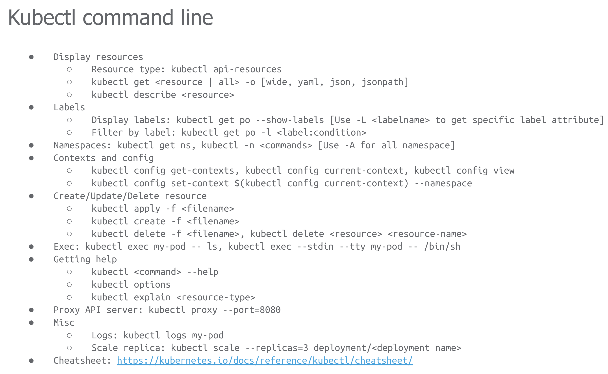

```shell
kubectl < get | delete | create >   < resource_type>
```

Example:

* Getting all the pods `kubectl get pods`
* Getting specific pod `kubectl get pod my-pod`
* Creation, you can also use apply command `kubectl < create | apply >  -f ./my-pod-config.yml`
* Port-forwarding `kubectl port-forward my-pod 8080:80`



REF: https://github.com/ChrisKlug/K8S4DEVS
REF: https://github.com/VergeOps/k8s-rvstore/tree/master/exercises/day%204


