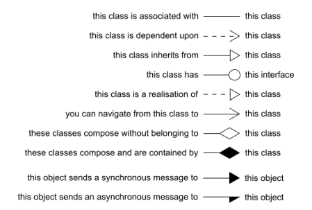
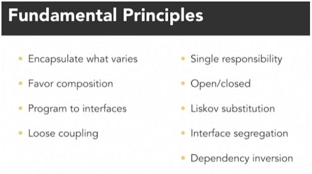
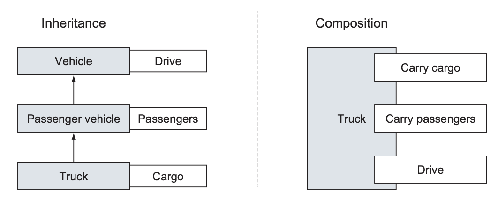

# oops_and_design_patterns

* Single Responsibility Principle

* Open/Closed Principle

* Liskov-Substitution Principle

Java REF: http://people.eecs.berkeley.edu/~jrs/61b/ and https://ocw.mit.edu/courses/electrical-engineering-and-computer-science/6-092-introduction-to-programming-in-java-january-iap-2010/lecture-notes/

Design Patterns REF: https://www.d.umn.edu/~gshute/softeng/new/design_patterns/design_patterns.xhtml

Object-Oriented programming lets you extend a program without having to touch previously-tested, working code.

Ref: https://www.dre.vanderbilt.edu/~schmidt/cs251/C++/lectures/PDFs/

THE LANGUAGE OF OBJECT-ORIENTED PROGRAMMING
===========================================
* Object: An object is a repository of data. For example, if MyList is a
 ShoppingList object, MyList might record your shopping list.
* Class: A class is a type of object. Many objects of the same class might exist; 
  for instance, MyList and YourList may both be ShoppingList objects. 
  A class is a template for creating objects. 
* Method: A procedure or function that operates on an object or a class.
 A method is associated with a particular class. For instance, addItem might
 be a method that adds an item to any ShoppingList object. Sometimes a method
 is associated with a family of classes. For instance, addItem might operate
 on any List, of which a ShoppingList is just one type.
* Inheritance: A class may inherit properties from a more general class. For
 example, the ShoppingList class inherits from the List class the property of
 storing a sequence of items.
* Polymorphism: The ability to have one method call work on several different
 classes of objects, even if those classes need different implementations of
 the method call. For example, one line of code might be able to call the
 "addItem" method on _every_ kind of List, even though adding an item to a
 ShoppingList is completely different from adding an item to a ShoppingCart.
* Object-Oriented: Each object knows its own class and which methods manipulate
 objects in that class. Each ShoppingList and each ShoppingCart knows which
 implementation of addItem applies to it.

In this list, the one thing that truly distinguishes object-oriented languages
from procedural languages (C, Fortran, Basic, Pascal) is polymorphism.

## The four pillars of object-oriented programming are:

* Abstraction
* Encapsulation
* Inheritance
* Polymorphism

### Inheritance
Inheritance, the concept that we can reuse features or behaviors of a class by inheriting from it. 

You avoid duplicate code. You define a common protocol for a group of classes.

You get a lot of OO mileage by designing with inheritance. You can get rid of duplicate
code by abstracting out the behavior common to a group of classes and sticking that code
in a superclass. That way, when you need to modify it, you have only one place to update.

Inheritance allows a class to inherit the attributes and methods of another class. This
allows the creation of brand-new classes by abstracting out common attributes and behaviors.

### Encapsulation
Encapsulation is defined by the fact that objects contain both attributes and behaviors. Data hiding is a major part of encapsulation.

Encapsulation, we can hide and protect the data in a class. 

Encapsulation is accomplished when each object maintains a private state, inside a class. Other objects can not access this state directly, instead, they can only invoke a list of public functions. The object manages its own state via these functions and no other class can alter it unless explicitly allowed. In order to communicate with the object, you will need to utilize the methods provided. 

### Polymorphism
Polymorphism is a Greek word that literally means many shapes. Polymorphism is derived from 2 Greek words: poly(many) and morphs(forms), so polymorphism means "many forms". 

Polymorphism, the idea that we can write code that works for types, and their subtypes.

Polymorphism gives us a way to use a class exactly like its parent so there is no confusion with mixing types. 
This being said, each child sub-class keeps its own functions/methods as they are.

A subclass can define its own unique behavior and still share the same functionalities or behavior of its parent/base class.
In short, each class is able to respond differently to the same method. Hence the word Polymorphism.

Ref: https://javaranch.com/campfire/StoryPoly.jsp

### Abstraction
Abstraction, where we can hide away implementation details only relying on a class type or an interface.

Abstraction is an extension of encapsulation. It is the process of selecting data from a larger pool to show only the relevant details to the object. 

### Composition
It is natural to think of objects as containing other objects.

A computer contains video cards, keyboards, and drives. Although the computer can be considered an object 
unto itself, the drive is also considered a valid object. 

In fact, you could open up the computer and remove the drive and hold it in your
hand. Both the computer and the drive are considered objects. It is just that the computer
contains other objects—such as drives.

In this way, objects are often built, or composed, from other objects: This is composition.

Just as with inheritance, composition provides a mechanism for building objects.

### UML diagrams notation

When creating a diagram using the Unified Modeling Language (UML), there are two views that
can be expressed. 
* The first is the contents and components of an individual class itself, the
internal view of the class.
* The second is the view reflecting relationships between classes, the
external view of the class.

Both parts are necessary for us to understand the internal structure
and external relationships related to a class.

#### Internal view

#### External relationships

### Fundamental Priniciples

Encapsulate what varies: Identify the aspects of your application that vary and separate them from what stays the same. Letting one part of the system vary independently.

### Inheritance versus composition

Inheritance allows one class to inherit from another
class. We can thus abstract out attributes and behaviors for common classes.
For example, dogs and cats are both mammals because a dog `is-a` mammal, and a cat `is-a` mammal.

With composition, we can also build classes by embedding classes in other classes.
Consider the relationship between a car and an engine. The benefits of separating the
engine from the car are evident. 

By building the engine separately, we can use the engine
in various cars—not to mention other advantages. But we can’t say that an engine is-a car.
This just doesn’t sound right when it rolls off the tongue (and because we are modeling
real-world systems, this is the effect we want). 

Rather, we use the term has-a to describe composition relationships. A car `has-a(n)` engine.

### Good Practices
* One of the main advantages of OO programming is that classes can be reused. In general,
reusable classes tend to have interfaces that are more abstract than concrete.

### When is the constructor called?
The new keyword creates a new instance of the `class`, thus allocating the required memory.

Then the constructor itself is called, passing the arguments in the parameter list.

The constructor provides the developer the opportunity to attend to the
appropriate initialization.

Code included inside a constructor should
set the newly created object to its initial, stable, safe state.

### Method Overloading

Overloading allows a programmer to use the same method name over and over, as long as
the signature of the method is different each time.

The signature consists of the method name and a parameter list. (Depending on the language, the signature may or may not include the return type. In Java
and C#, the return type is not part of the signature.)

### Multiple Inheritance

Multiple inheritance is a very powerful technique, and in fact, some problems are quite difficult to solve without it. 

Multiple inheritance can even solve some problems quite elegantly. However, multiple inheritance can significantly increase the complexity of a system, both for
the programmer and the compiler writers.

The designers of Java and .NET decided that the increased complexity of allowing multiple inheritance far outweighed its advantages, so they
eliminated it from the language.
