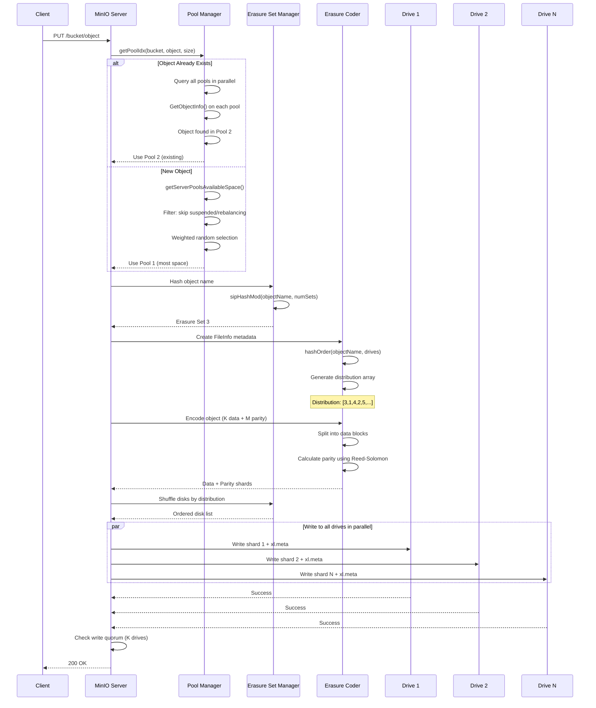
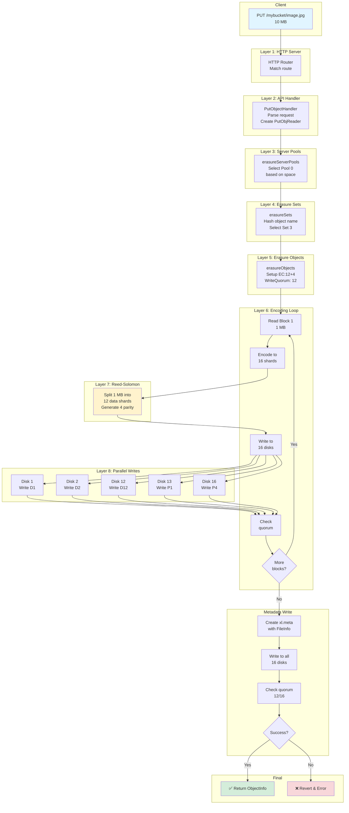
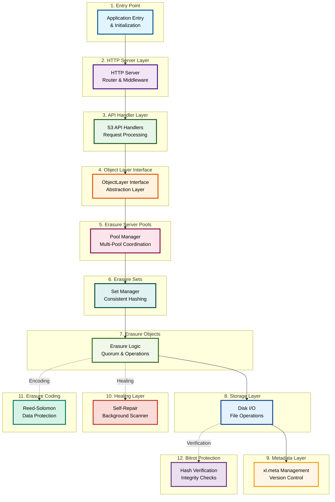
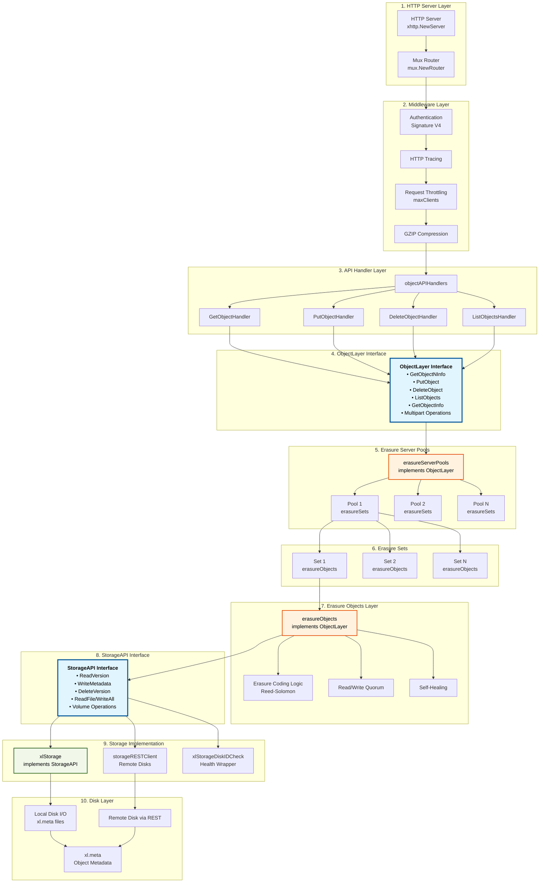
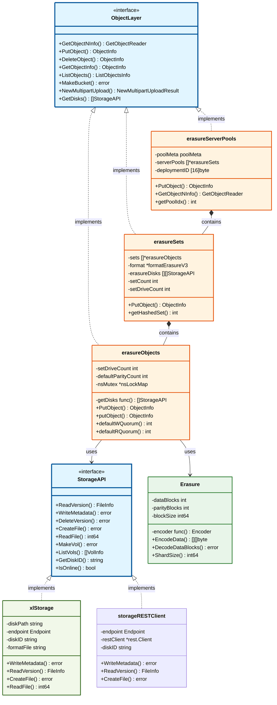

# MinIO Architecture & Object Storage Deep Dive

MinIO just does one thing - **Object storage for Private cloud**


This document provides a comprehensive overview of MinIO's architecture, how it stores objects, distributes data across servers, and retrieves objects.

## Table of Contents

1. [Core Principles](#core-principles)
2. [High-Level Architecture](#high-level-architecture)
3. [System Components](#system-components)
4. [Object Storage Internals](#object-storage-internals)
5. [Erasure Coding](#erasure-coding)
6. [PUT Operation (Storing Objects)](#put-operation)
7. [GET Operation (Retrieving Objects)](#get-operation)
8. [Distributed Architecture](#distributed-architecture)
9. [Server Pools](#server-pools)
10. [Code Architecture](#code-architecture)
11. [Healing & Self-Recovery](#healing)
12. [Advanced Features](#advanced-features)
13. [Deprecated Gateway](#deprecated-gateway)
14. [Real-World Metadata Examples](#real-world-examples)

---

## Core Principles

MinIO is built on several fundamental design principles:

- **Metadata-Free Design**: No centralized metadata database. Object metadata is stored locally on each disk alongside the data (in `xl.meta` files). This eliminates the metadata bottleneck and prevents cluster-wide failures.
- **Shared-Nothing Architecture**: Each node operates independently. Data is distributed and scattered across multiple nodes and disks, with no single point of failure.
- **S3 Compatibility**: Full S3 API compatibility allows seamless migration from AWS S3 or other S3-compatible systems.
- **Erasure Coding + Bitrot Protection**: Multi-level data protection using Reed-Solomon erasure coding and HighwayHash checksums. Even if you lose more than half of your hard drives, you can still recover data. (N/2)-1 node failure is allowed in distributed mode.
- **Rebalance-Free Expansion**: Add new pools without rebalancing existing data.
- **No Master Node**: All nodes are peers in a decentralized architecture using distributed locking (dsync).

### How MinIO Compares to Legacy Storage
* Minio adopts a metadata-free database design for high performance, avoiding the metabase becoming a performance bottleneck for the entire system, and limiting failures to a single cluster, so that no other clusters are involved.
* Minio is also fully compatible with the S3 interface, so it can also be used as a gateway to provide S3 access to the outside world.
* Use both Minio Erasure code and checksum to prevent hardware failures. Even if you lose more than half of your hard drive, you can still recover from it. (N/2)-1 node failure is also allowed in the distribution


### Legacy Object Storage Architecture


---

## High-Level Architecture


```
┌─────────────────────────────────────────────────────────────────┐
│                      Client (S3 API)                            │
│              PUT/GET/DELETE/LIST Requests                       │
└────────────────────────┬────────────────────────────────────────┘
                         │
┌────────────────────────▼────────────────────────────────────────┐
│                  HTTP Server & Router                           │
│         (Authentication, Throttling, Compression)              │
└────────────────────────┬────────────────────────────────────────┘
                         │
┌────────────────────────▼────────────────────────────────────────┐
│              API Handlers (GET/PUT/DELETE/LIST)                │
└────────────────────────┬────────────────────────────────────────┘
                         │
┌────────────────────────▼────────────────────────────────────────┐
│            ObjectLayer Interface (Abstraction)                  │
└────────────────────────┬────────────────────────────────────────┘
                         │
┌────────────────────────▼────────────────────────────────────────┐
│         erasureServerPools (Multi-Pool Manager)                │
│  - Weighted pool selection based on available space            │
│  - Pool expansion & decommissioning                            │
└────────────────────────┬────────────────────────────────────────┘
                         │
        ┌────────────────┼────────────────┐
        │                │                │
┌───────▼────┐   ┌───────▼────┐   ┌──────▼──────┐
│  Pool 1    │   │  Pool 2    │   │  Pool N     │
│ erasureSets│   │ erasureSets│   │ erasureSets │
└───────┬────┘   └───────┬────┘   └──────┬──────┘
        │                │                │
     ┌──┴──┐          ┌──┴──┐          ┌──┴──┐
     │Set1 │          │Set1 │          │Set1 │
     └──┬──┘          └──┬──┘          └──┬──┘
        │
┌───────▼──────────────────────────────────────────────────────┐
│  erasureObjects (Single Set - Erasure Coding Logic)         │
│  - Reed-Solomon EC:M+N encoding/decoding                    │
│  - Quorum-based read/write                                  │
│  - Object-level healing                                     │
└───────┬──────────────────────────────────────────────────────┘
        │
┌───────▼──────────────────────────────────────────────────────┐
│  StorageAPI Interface (Local & Remote Disk I/O)             │
│  - xlStorage (local), storageRESTClient (remote)            │
└───────┬──────────────────────────────────────────────────────┘
        │
   ┌────┴─────────────────────┬──────────────────┐
   │                          │                  │
┌──▼──┐ ┌──────┐ ┌──────────┐│ ┌──────────────┐
│Disk1│ │Disk2 │ │  Disk..  ││ │  Disk16      │
│     │ │      │ │          ││ │              │
│     │ │      │ │          ││ │              │
└─────┘ └──────┘ └──────────┘│ └──────────────┘
                             └─ (Parallel I/O)
```

---

## System Components

### 1. HTTP Server Layer
- Handles incoming S3 API requests
- Middleware chain: Auth (Signature V4), Tracing, Throttling, GZIP compression
- Routes requests to appropriate handlers

### 2. API Handler Layer
- `GetObjectHandler`: Retrieves objects
- `PutObjectHandler`: Stores objects
- `DeleteObjectHandler`: Deletes objects
- `ListObjectsHandler`: Lists bucket contents
- Multipart upload handlers

### 3. ObjectLayer Interface
Abstract interface implemented by `erasureServerPools`, `erasureSets`, and `erasureObjects`. Provides unified S3 operations.

### 4. Erasure Server Pools
- Manages multiple independent pools
- Selects pool based on available space (weighted random)
- Enables non-disruptive expansion
- Each pool has its own erasure sets

### 5. Erasure Sets
- Routes objects to correct set using consistent hash (SipHash)
- One set contains all disks in the erasure set
- Uses deterministic placement: same object name → same set always

### 6. Erasure Objects
- Core logic for encoding/decoding
- Manages read/write quorum
- Handles object-level healing
- Coordinates with StorageAPI

### 7. Storage Layer
- **xlStorage**: Local disk I/O, metadata, file operations
- **storageRESTClient**: Remote disk via REST API
- **xlStorageDiskIDCheck**: Health wrapper for disk monitoring

---

## Object Storage Internals

### On-Disk Layout

Each disk in a MinIO cluster stores data in the following structure:

```
disk1/
├── .minio.sys/
│   ├── format.json              # Cluster configuration
│   ├── config/                  # Server configuration
│   ├── buckets/                 # Bucket metadata
│   └── tmp/                     # Temporary files during writes
│
├── bucket1/
│   ├── object1/
│   │   ├── xl.meta              # Metadata (MessagePack serialized)
│   │   └── a1b2c3d4-e5f6.../   # DataDir UUID (contains data shard)
│   │       └── part.1           # Actual shard data
│   └── object2/
│       └── ...
└── bucket2/
    └── ...
```

### xl.meta File Format

The `xl.meta` file contains critical metadata in MessagePack binary format:

```
Header:
- Magic: "XL2 "
- Version: 1.3

Versions[] (Version History):
├── Type: ObjectType, DeleteType, or LegacyType
├── ObjectV2 (if ObjectType):
│   ├── VersionID: UUID (unique version identifier)
│   ├── DataDir: UUID (data directory on disk)
│   ├── ErasureAlgorithm: ReedSolomon
│   ├── ErasureM: Number of data blocks (e.g., 12)
│   ├── ErasureN: Number of parity blocks (e.g., 4)
│   ├── ErasureBlockSize: Block size for encoding (1MB default)
│   ├── ErasureIndex: This disk's shard index (0-15)
│   ├── ErasureDist: Distribution array [disk_index_0, disk_index_1, ...]
│   ├── BitrotChecksumAlgo: HighwayHash (for integrity)
│   ├── PartNumbers: Part IDs (multipart uploads)
│   ├── PartSizes: Size of each part
│   ├── Size: Total object size
│   ├── ModTime: Modification timestamp (Unix nanoseconds)
│   ├── MetaSys: System metadata (inline data flag, etc.)
│   └── MetaUsr: User metadata (Content-Type, custom headers)
```

### format.json - Cluster Configuration

Located at `.minio.sys/format.json` on each disk:

```json
{
  "version": "1",
  "format": "xl",
  "id": "deployment-uuid",
  "xl": {
    "version": "3",
    "this": "disk-uuid",
    "sets": [
      ["disk-0", "disk-1", "disk-2", ..., "disk-15"],
      ["disk-16", "disk-17", "disk-18", ..., "disk-31"]
    ],
    "distributionAlgo": "SIPMOD"
  }
}
```

**Key Fields**:
- `id`: Cluster deployment ID (shared by all disks)
- `this`: UUID of current disk
- `sets`: Array of erasure sets, each containing disk UUIDs
- `distributionAlgo`: Algorithm used for object placement (SipHash with parity consideration)

---

## Erasure Coding

### Reed-Solomon Encoding

MinIO uses Reed-Solomon erasure coding (via `klauspost/reedsolomon` library):

**Example Configuration (16 disks)**:
- EC:12+4 (12 data shards + 4 parity shards)
- Block size: 1MB default
- Can tolerate: Up to 4 disk failures per erasure set

### How It Works

**Encoding (Write)**:
```
Original File (10MB)
        │
        ▼
┌──────────────────────────────────┐
│ Split into 1MB blocks (10 blocks)│
└──────────────────────────────────┘
        │
        ▼
┌──────────────────────────────────────────────────────┐
│ For each 1MB block:                                  │
│ ├─ Split into 12 data shards (~85KB each)           │
│ └─ Generate 4 parity shards (~85KB each)            │
│                                                      │
│ Result: 16 shards per block (12 data + 4 parity)   │
└──────────────────────────────────────────────────────┘
        │
        ▼
┌──────────────────────────────────────────────────────┐
│ Write to 16 disks in parallel:                       │
│ ├─ Disk 0: shard_0 (all blocks)                     │
│ ├─ Disk 1: shard_1 (all blocks)                     │
│ ├─ Disk 12-15: parity shards                        │
│ └─ All disks: xl.meta (metadata)                    │
└──────────────────────────────────────────────────────┘
```

**Decoding (Read)**:
```
Read Request for 10MB object
        │
        ▼
┌──────────────────────────────────┐
│ Scenario 1: All 16 disks healthy │
│ ├─ Read 12 data shards           │
│ ├─ Ignore 4 parity shards        │
│ └─ Reconstruct original data     │
└──────────────────────────────────┘

┌──────────────────────────────────┐
│ Scenario 2: 2 disks dead         │
│ ├─ Read 14 available shards      │
│ ├─ Use Reed-Solomon to recover   │
│ │  missing 2 shards              │
│ └─ Reconstruct original data     │
└──────────────────────────────────┘

┌──────────────────────────────────┐
│ Scenario 3: 5+ disks dead        │
│ └─ READ FAILS (quorum lost)      │
└──────────────────────────────────┘
```

### Read/Write Quorum

**Read Quorum**: M (data blocks)
- Need M shards available to reconstruct object
- Example: EC:12+4 → need 12 out of 16 disks

**Write Quorum**:
- If parity < 50% of drives: Write Quorum = M (data blocks)
- If parity = 50% of drives: Write Quorum = M + 1 (avoid split-brain)
- Example: EC:12+4 (16 disks) → Write Quorum = 12

### Erasure Coding Visual


The value K here constitutes the read quorum for the deployment. The erasure set must therefore have at least K healthy drives to support read operations.

For a small object with only 1 part (`part.1`), here we have 2 data blocks and 2 parity blocks:


Ref: https://blog.min.io/erasure-coding-vs-raid/

Not only does MinIO erasure coding protect against drive and node failures, MinIO also heals at the **object level**:
- Heal one object at a time vs RAID which heals at volume level
- A corrupt object restored in seconds vs. hours in RAID

### Read Request Flow


### Write Request Flow

Two cases for write quorum:
* **Case 1**: Parity < 50% of drives → Write Quorum = Parity
* **Case 2**: Parity = 50% of drives → Write Quorum = Parity + 1

> If parity equals 1/2 (half) the number of erasure set drives, write quorum equals parity + 1 to avoid data inconsistency due to 'split brain' scenarios.


### Bitrot Protection

MinIO protects against **silent data corruption** (BitRot):

- **HighwayHash Algorithm**: Computes 256-bit hash per block
- **Verification**: Hash checked on every read
- **Performance**: >10 GB/sec hashing on single Intel CPU core
- **Storage Format**: `[hash | data | hash | data | ...]`
- **Detection**: Hash mismatch → disk marked bad → reconstruction

---

## PUT Operation

### Step-by-Step Flow (Storing a 10MB Object)

```
1. CLIENT REQUEST
   │
   ├─ PUT /bucket/photos/vacation.jpg (10MB)
   │
   ▼

2. HTTP HANDLER
   │
   ├─ Parse request, extract bucket/object name
   ├─ Verify authentication (Signature V4)
   ├─ Create hash verifier (for bitrot)
   │
   ▼

3. POOL SELECTION
   │
   ├─ If object already exists:
   │  └─ Use same pool as existing version
   │
   └─ If new object:
      ├─ Calculate available space for each pool
      ├─ Filter: skip suspended/rebalancing pools
      ├─ Weighted random selection (prefer pool with most space)
      └─ Select Pool 0
   │
   ▼

4. SET SELECTION (Consistent Hashing)
   │
   ├─ Hash object name using SipHash:
   │  setIndex = sipHashMod("photos/vacation.jpg", numSets, deploymentID) % numSets
   │
   ├─ Result: Always same set for same object name (deterministic)
   └─ Select Erasure Set 3
   │
   ▼

5. CREATE METADATA
   │
   ├─ Generate UUIDs:
   │  ├─ VersionID: Unique identifier for this version
   │  └─ DataDir: Directory to store data shards
   │
   ├─ Calculate distribution order:
   │  └─ hashOrder(objectName, diskCount) = [3, 1, 4, 2, 5, ...]
   │
   ├─ Set erasure parameters:
   │  ├─ ErasureM = 12 (data blocks)
   │  ├─ ErasureN = 4 (parity blocks)
   │  └─ BlockSize = 1MB
   │
   ▼

6. ERASURE ENCODING
   │
   ├─ Read data in 1MB blocks (10 blocks total)
   │
   ├─ For each block:
   │  ├─ Split into 12 data shards (~85KB each)
   │  ├─ Compute 4 parity shards using Reed-Solomon
   │  ├─ Add HighwayHash checksum to each shard
   │  └─ Result: 16 shards per block
   │
   ▼

7. DISK ORDERING (Distribution)
   │
   ├─ Take 16 disks from Set 3
   ├─ Shuffle according to distribution order
   └─ Map shards: shard_i → disk_i
   │
   ▼

8. PARALLEL WRITES
   │
   ├─ For each of 16 disks (in parallel):
   │  │
   │  ├─ Write to temporary location:
   │  │  .minio.sys/tmp/{VersionID}/{DataDir}/part.1
   │  │
   │  ├─ Format: [block1_hash|block1_data|block2_hash|block2_data|...]
   │  │
   │  └─ Verify write success
   │
   ├─ Check write quorum: Need ≥12 successful writes
   │  └─ If <12 fail: WRITE FAILS, cleanup
   │
   ▼

9. ATOMIC RENAME
   │
   ├─ Once quorum reached:
   │  └─ Rename all temp files to final location:
   │     bucket/object/{DataDir}/part.1
   │
   ▼

10. METADATA PERSISTENCE
    │
    ├─ Create xl.meta with all object metadata
    │ ├─ Version history
    │ ├─ Erasure config
    │ ├─ Distribution array
    │ └─ Part sizes
    │
    ├─ Write xl.meta to all 16 disks (in parallel)
    │
    ├─ Verify metadata quorum (≥12 successful)
    │
    ▼

11. SUCCESS
    │
    └─ Return 200 OK + ETag to client
```

### PUT Request Overview


For example, with 5 data blocks and 3 parity blocks:


### PUT Request Sequence



### PUT Layer-by-Layer Graph



### Key Decisions

**Pool Selection Algorithm** (Weighted Random):
```go
totalFreeSpace = sum of free space in all pools
choose = random(0, totalFreeSpace)
for each pool:
    if pool.freeSpace >= choose:
        select this pool
        break
    choose -= pool.freeSpace
```

**Set Selection Algorithm** (Consistent Hash):
```go
func sipHashMod(key string, cardinality int, id [16]byte) int {
    k0, k1 := binary.LittleEndian.Uint64(id[0:8]),
             binary.LittleEndian.Uint64(id[8:16])
    sum64 := siphash.Hash(k0, k1, []byte(key))
    return int(sum64 % uint64(cardinality))
}
```

---

## GET Operation

### Step-by-Step Flow (Retrieving a 10MB Object)

```
1. CLIENT REQUEST
   │
   ├─ GET /bucket/photos/vacation.jpg
   │ Optional: Range header (e.g., bytes=2097152-10485760)
   │
   ▼

2. HTTP HANDLER
   │
   ├─ Parse request
   ├─ Verify authentication
   ├─ Check preconditions (If-Match, If-Modified-Since)
   │
   ▼

3. SET LOOKUP (Same Hash as Write)
   │
   ├─ Hash object name using same SipHash
   │  → Deterministically routes to same set as original write
   │
   └─ Select Erasure Set 3
   │
   ▼

4. METADATA READING
   │
   ├─ Read xl.meta from ALL 16 disks (in parallel)
   │
   ├─ Verify quorum: Need ≥12 successful reads
   │  └─ If <12: READ FAILS
   │
   ├─ Select latest version (by ModTime)
   │
   ├─ Extract:
   │  ├─ Erasure config (M, N, block size)
   │  ├─ Part sizes and ETags
   │  ├─ Distribution order
   │  └─ Shard indices
   │
   ▼

5. PARALLEL SHARD READING
   │
   ├─ Create readers for all 16 disks
   │
   ├─ Read in parallel:
   │  ├─ Each disk returns its shard blocks
   │  ├─ Verify HighwayHash per block
   │  │  └─ Hash mismatch → mark disk as bad
   │  └─ Stop reading once we have ≥12 good shards
   │
   ▼

6. RECONSTRUCTION (If Needed)
   │
   ├─ If all 16 disks healthy:
   │  └─ Use 12 data shards directly
   │
   └─ If some disks failed/corrupted:
      ├─ Use Reed-Solomon decoder
      ├─ Reconstruct missing shards from available ones
      └─ Need at least M (12) shards to reconstruct
   │
   ▼

7. RANGE EXTRACTION (If Range Header Present)
   │
   ├─ If range requested (e.g., bytes 2-10MB):
   │  ├─ Extract only requested byte range
   │  └─ Efficient: Don't read entire object
   │
   ├─ Apply decompression (if S2 compression used)
   │
   ├─ Apply decryption (if AES-256-GCM encryption used)
   │
   ▼

8. STREAM TO CLIENT
   │
   ├─ Set Content-Length header
   ├─ Set Content-Range (if range request)
   ├─ Stream data directly to HTTP response body
   │
   ▼

9. SUCCESS
    │
    └─ Return 200 OK (or 206 Partial Content for range)
```

### Failure Scenarios

| Scenario | Disks Available | Status | Action |
|----------|-----------------|--------|--------|
| All healthy | 16/16 | ✅ Success | Read 12 data shards |
| 1 disk dead | 15/16 | ✅ Success | Read 12 data shards from remaining |
| 2 disks dead | 14/16 | ✅ Success | Read 12+ shards, reconstruct if needed |
| 4 disks dead | 12/16 | ✅ Success | Read 12 available shards (at limit) |
| 5+ disks dead | <12/16 | ❌ FAIL | Cannot read (quorum lost) |

---

## Distributed Architecture

All the nodes running a distributed MinIO setup are recommended to be homogeneous — same operating system, same number of drives, and same network interconnects.


* No master server, no metadata server

Ref: https://github.com/minio/minio/blob/master/docs/distributed/README.md

MinIO adopts a decentralized shared-nothing architecture, where object data is scattered and stored on multiple hard disks on different nodes, providing unified namespace access and load balancing between servers through load balancing or DNS round-robin.

### Erasure Set Organization (4 Servers × 4 Disks Each = 16 Disks Total)

```
Server 1: [D1] [D2] [D3] [D4]
Server 2: [D5] [D6] [D7] [D8]
Server 3: [D9] [D10][D11][D12]
Server 4: [D13][D14][D15][D16]

            ↓ Round-Robin Assignment ↓

Erasure Set 0: [D1, D5, D9, D13, D2, D6, D10, D14, ...]
                S1   S2   S3   S4   S1   S2   S3    S4

Key: Each set has disks from ALL servers
```

### Fault Tolerance

**If Server 3 Dies**:
```
Set contains: [D1(S1), D5(S2), D9(S3), D13(S4), ...]

After S3 failure:
├─ Available: D1(S1) ✓, D5(S2) ✓, D13(S4) ✓
├─ Dead: D9(S3) ✗
├─ Tolerance: EC:12+4 can lose up to 4 disks
│
└─ Result: SAFE - Can still read and recover
```

**If Any 4 Disks Die**:
```
Available shards: 12 (exactly at read quorum)
Parity tolerance: 4
Result: Still readable but no fault tolerance left
```

**If 5+ Disks Die**:
```
Available shards: <12 (below read quorum)
Result: UNRECOVERABLE - READ FAILS
```

---

## Server Pools


A server pool is a set of MinIO server nodes which pool their drives and resources, creating a unit of expansion. All nodes in a server pool share their hardware resources in an isolated namespace.

The other important point here involves rebalance-free, non-disruptive expansion. With MinIO's server pool approach - rebalancing is not required to expand. Ref: https://blog.min.io/no-rebalancing-object-storage/

A MinIO cluster is built on server pools, and server pools are built on erasure sets.


### Multi-Pool Architecture

MinIO can have multiple independent pools for expansion:

```
Cluster
├── Pool 1 (16 disks, 4 nodes)
│   ├─ Erasure Set 0
│   └─ Erasure Set 0 (shared)
│
├── Pool 2 (32 disks, 4 nodes)
│   ├─ Erasure Set 1
│   └─ Erasure Set 2
│
└── Pool 3 (48 disks, 4 nodes)
    ├─ Erasure Set 3
    ├─ Erasure Set 4
    └─ Erasure Set 5
```

### Pool Expansion (Rebalance-Free)

1. **Add new pool**: MinIO detects new endpoints at startup
2. **Update format files**: Cluster configuration updated
3. **New objects**: Distributed across all pools by available space
4. **Existing objects**: Stay in original pool (no rebalancing)
5. **Decommission**: Background migration copies objects to other pools

### Weighted Random Selection

When adding new object to new pool:
- Calculate available space: Pool1=500GB, Pool2=200GB, Pool3=300GB (total=1TB)
- Generate random number: 0-1000GB
- If 0-500: Pool1, if 500-700: Pool2, if 700-1000: Pool3
- Result: Pools filled proportionally to their capacity

---

## Code Architecture

### Layer Hierarchy



### Detailed Layer Flow



### Interface Class Diagram



### Key Interfaces

**ObjectLayer Interface**:
```go
type ObjectLayer interface {
    // Bucket operations
    MakeBucket(ctx, bucket, opts) error
    GetBucketInfo(ctx, bucket, opts) (BucketInfo, error)
    ListBuckets(ctx, opts) ([]BucketInfo, error)
    DeleteBucket(ctx, bucket, opts) error
    ListObjects(...) (ListObjectsInfo, error)
    ListObjectVersions(...) (ListObjectVersionsInfo, error)

    // Object operations
    GetObjectNInfo(ctx, bucket, object, rangeSpec, headers, opts) (*GetObjectReader, error)
    GetObjectInfo(ctx, bucket, object, opts) (ObjectInfo, error)
    PutObject(ctx, bucket, object, data, opts) (ObjectInfo, error)
    CopyObject(ctx, srcBucket, srcObject, dstBucket, dstObject, ...) (ObjectInfo, error)
    DeleteObject(ctx, bucket, object, opts) (ObjectInfo, error)
    DeleteObjects(ctx, bucket, objects, opts) ([]DeletedObject, []error)

    // Multipart operations
    NewMultipartUpload(ctx, bucket, object, opts) (*NewMultipartUploadResult, error)
    PutObjectPart(ctx, bucket, object, uploadID, partID, data, opts) (PartInfo, error)
    CompleteMultipartUpload(ctx, bucket, object, uploadID, parts, opts) (ObjectInfo, error)
    AbortMultipartUpload(ctx, bucket, object, uploadID, opts) error

    // Healing & Info
    HealFormat(ctx, dryRun) (HealResultItem, error)
    HealBucket(ctx, bucket, opts) (HealResultItem, error)
    HealObject(ctx, bucket, object, versionID, opts) (HealResultItem, error)
    StorageInfo(ctx, metrics bool) StorageInfo
}
```

**StorageAPI Interface**:
```go
type StorageAPI interface {
    // Metadata
    ReadVersion(ctx, origvolume, volume, path, versionID, opts) (FileInfo, error)
    WriteMetadata(ctx, origvolume, volume, path, fi) error
    DeleteVersion(ctx, volume, path, fi, ...) error

    // File operations
    ReadFile(ctx, volume, path, offset, buf, verifier) (n, error)
    CreateFile(ctx, origvolume, volume, path, size, reader) error
    ReadFileStream(ctx, volume, path, offset, length) (io.ReadCloser, error)
    AppendFile(ctx, volume, path, buf) error
    Delete(ctx, volume, path, opts) error

    // Volume operations
    MakeVol(ctx, volume) error
    ListVols(ctx) ([]VolInfo, error)
    StatVol(ctx, volume) (VolInfo, error)
    DeleteVol(ctx, volume, forceDelete bool) error

    // Disk info
    IsOnline() bool
    GetDiskID() (string, error)
    DiskInfo(ctx, opts) (DiskInfo, error)
}
```

### Implementations

| Component | Location | Role |
|-----------|----------|------|
| `erasureServerPools` | `cmd/erasure-server-pool.go` | Pool orchestration, weighted selection |
| `erasureSets` | `cmd/erasure-sets.go` | Set routing, consistent hashing |
| `erasureObjects` | `cmd/erasure-object.go` | Core put/get/delete with EC |
| `xlStorage` | `cmd/xl-storage.go` | Local disk I/O |
| `storageRESTClient` | `cmd/storage-rest-client.go` | Remote disk via REST |
| `Erasure` | `cmd/erasure-coding.go` | Reed-Solomon encode/decode |

---

## Healing

MinIO performs automatic background healing to detect and repair corrupted objects:

### Healing Mechanisms

1. **Bitrot Detection**: HighwayHash checksum verification on every read
2. **Bad Disk Detection**: Continuous health monitoring of all disks
3. **Object-Level Healing**: Corrupted objects repaired in seconds (vs RAID hours)
4. **Background Scanner**: Periodic scan of all objects to detect bitrot proactively

### Healing Flow

```
Bad block detected (hash mismatch)
        │
        ▼
Mark disk as bad
        │
        ▼
Read remaining 15 shards (12+ available)
        │
        ▼
Use Reed-Solomon to reconstruct missing shard
        │
        ▼
Repair disk by writing reconstructed shard
        │
        ▼
Verify repair with new hash
        │
        ▼
Continue serving object (healed)
```

---

## Gateway Mode (Deprecated)

MinIO introduced gateway mode early on to provide S3 API compatibility to legacy systems:


**Why Deprecated**:
- Critical S3 features (versioning, replication, locking, encryption) couldn't work in gateway mode without proprietary formats
- Would defeat the purpose of direct backend access
- Better to run MinIO in server mode than as a stateless proxy
- S3 API now ubiquitous (partly due to MinIO Gateway work)

**Lessons Learned**:
- S3 API evolved significantly since gateway inception
- Inline translation is insufficient for modern S3 capabilities
- Backends become mere storage media, which is essentially running MinIO anyway

Reference: [Gateway Migration](https://blog.min.io/minio-gateway-migration/) and [Deprecation Details](https://blog.min.io/deprecation-of-the-minio-gateway/)

---

## Advanced Features

### Versioning
- Keep multiple versions of an object
- Each version has separate `xl.meta` entry
- Access previous versions without data loss

### Object Locking (WORM)
- Write Once, Read Many protection
- Objects immutable for set retention period
- Compliance and audit requirements

### Lifecycle Management
- Automatic object deletion/transition after time period
- Move to different storage classes
- Cost optimization

### Replication
- Automatic cross-cluster replication
- Disaster recovery and high availability
- Real-time synchronization

### IAM & Access Control
- User authentication (basic, LDAP, OAuth)
- Bucket policies (similar to AWS S3)
- Access key/secret pairs

### Encryption

Server-side encryption (SSE-S3, SSE-KMS) and client-side encryption support with master key rotation.


---

## Distributed Locking (dsync)

MinIO avoids consistency issues using distributed locking:

### How dsync Works

1. **Lock Request**: Any node broadcasts lock request to all nodes
2. **Quorum**: If N/2+1 nodes approve → lock acquired
3. **No Master**: Every node is peer; no single authority
4. **Stale Detection**: Between-node heartbeats detect offline nodes

### Limitations
- Supports up to 32 nodes (theoretical)
- Lock throughput decreases as cluster grows
- Can lose locks in certain scenarios (acceptable for MinIO's use case)

---

## Quick Reference: Key Concepts

| Concept | Definition |
|---------|-----------|
| **Erasure Set** | Group of disks where objects are erasure coded |
| **Server Pool** | Collection of erasure sets, independent expansion unit |
| **Consistent Hash** | SipHash used to deterministically place objects |
| **Read Quorum** | Minimum shards needed to reconstruct object (M data shards) |
| **Write Quorum** | Minimum disks that must acknowledge write (M or M+1) |
| **BitRot** | Silent data corruption, detected via HighwayHash |
| **xl.meta** | Metadata file containing object info, stored on all disks |
| **DataDir** | UUID-named directory storing object's data shard |
| **Reed-Solomon** | Erasure coding algorithm enabling data reconstruction |

---

## Performance Characteristics

- **Throughput**: GB/sec performance (limited by network)
- **Latency**: Milliseconds for PUT/GET operations
- **Scalability**: Supports petabyte-scale deployments
- **Fault Tolerance**: Up to N parity disks can fail per set
- **Healing**: Object-level healing in seconds
- **Bitrot Hashing**: >10 GB/sec on single CPU core

---

## Real-World Metadata Examples

### format.json from Actual Cluster

A 12-disk single erasure set cluster:

```json
{
  "version": "1",
  "format": "xl",
  "id": "f9a7a6ba-39d9-4483-bb47-fe86518bdc67",
  "xl": {
    "version": "3",
    "this": "9ae64de8-1c75-46df-b09d-ad8b97f95313",
    "sets": [
      [
        "4199dbce-78ba-4176-846d-7423ab6cfcd9",
        "22b83b76-f883-49c8-abc8-a3cf84eb92f4",
        "9ae64de8-1c75-46df-b09d-ad8b97f95313",
        "fc1a7dde-1da7-44cc-9380-3ae3063c415c",
        "48d7881f-6e93-42ab-9d89-f27bf0648b0d",
        "b8cfec44-f88b-4193-9575-368d92eefb16",
        "ef66b6f7-3c15-45fa-aca8-52286f4750f4",
        "02b3aa13-ff62-4e46-a196-f40b6f531c23",
        "f5dd8d65-56d7-40f2-9035-b4b37e3018a5",
        "ae4e30fd-db65-4c0e-a9c1-44f50191ba20",
        "d4cf829c-b96f-4687-845c-8884a43a6397",
        "2efc58b9-253a-4ac6-ba92-a316811f896c"
      ]
    ],
    "distributionAlgo": "SIPMOD+PARITY"
  }
}
```

**Explanation**:
- 1 erasure set with 12 disks (UUIDs in the sets array)
- Deployment ID: f9a7a6ba-39d9-4483-bb47-fe86518bdc67 (shared by all disks)
- Distribution Algorithm: SIPMOD+PARITY
- This disk position: 2 in the set (9ae64de8-1c75-46df-b09d-ad8b97f95313)

### Real xl.meta Example from Small File (65 bytes)

File content: `This is test data for xl.meta debugging with erasure coding EC:4`

```json
{
  "Versions": [
    {
      "Header": {
        "EcM": 8,
        "EcN": 4,
        "Flags": 6,
        "ModTime": "2026-01-14T16:53:55.923264863+05:30",
        "Signature": "b9f71a0b",
        "Type": 1,
        "VersionID": "00000000000000000000000000000000"
      },
      "Idx": 0,
      "Metadata": {
        "Type": 1,
        "V2Obj": {
          "CSumAlgo": 1,
          "DDir": "NhHND1OVRfWzQYC/GFqfGA==",
          "EcAlgo": 1,
          "EcBSize": 1048576,
          "EcDist": [1,2,3,4,5,6,7,8,9,10,11,12],
          "EcIndex": 3,
          "EcM": 8,
          "EcN": 4,
          "ID": "AAAAAAAAAAAAAAAAAAAAAA==",
          "MTime": 1768389835923264863,
          "MetaSys": {
            "x-minio-internal-inline-data": "dHJ1ZQ=="
          },
          "MetaUsr": {
            "content-type": "text/plain",
            "etag": "eeb5a84d38f5dac272eb0d3f772c8a59"
          },
          "PartASizes": [ 65 ],
          "PartETags": null,
          "PartNums": [  1],
          "PartSizes": [ 65 ],
          "Size": 65
        },
        "v": 1740736516
      }
    }
  ]
}
```

### xl.meta from a Different Disk (EcIndex=7)

Decoding `xl.meta` from another disk in the same erasure set shows the same object but a different shard:

```json
{
  "Versions": [
    {
      "Header": { "EcM": 8, "EcN": 4, "Type": 1, "VersionID": "00000000000000000000000000000000" },
      "Metadata": {
        "V2Obj": {
          "EcDist": [1,2,3,4,5,6,7,8,9,10,11,12],
          "EcIndex": 7,
          "EcM": 8,
          "EcN": 4,
          "MetaSys": { "x-minio-internal-inline-data": "dHJ1ZQ==" },
          "MetaUsr": { "content-type": "text/plain", "etag": "eeb5a84d38f5dac272eb0d3f772c8a59" },
          "Size": 65
        }
      }
    }
  ]
}
--- INLINE DATA ---
{
  "null": {
    "bitrot_valid": true,
    "bytes": 41,
    "data_base64": "b2RpbmcgRUM6",
    "data_string": "oding EC:"
  }
}
```

Notice `EcIndex: 7` (vs `EcIndex: 3` on the other disk) — each disk holds a different shard of the same object. The `data_string` differs (`"oding EC:"` vs `"for xl.me"`) confirming each disk stores its own slice.


### Data Distribution Visualization

For the 65-byte file above split into EC:8+4:

```
┌────────────────────────────────────────────────────────────────┐
│                    Original File (~65 bytes)                   │
│                   "...for xl.me...oding EC:..."                │
├────────────────────────────────────────────────────────────────┤
│                                                                │
│  Erasure Split into 8 Data Shards + 4 Parity Shards:           │
│                                                                │
│  EcDist: [1, 2, 3, 4, 5, 6, 7, 8, 9, 10, 11, 12]               │
│           ├─────────────────────┤ ├──────────────┤             │
│           8 DATA shards          4 PARITY shards               │
│                                                                │
│  Disk EcIndex=3: Contains data shard 3 → "for xl.me"           │
│  Disk EcIndex=7: Contains data shard 7 → "oding EC:"           │
│                                                                │
│  Disks 9-12 (EcIndex 9,10,11,12): Parity shards (for recovery) │
└────────────────────────────────────────────────────────────────┘
```

### Storing a Test File

```bash
# Create test bucket and upload file
kubectl exec minio-0 -- sh -c '
mc alias set local http://localhost:9000 $MINIO_ROOT_USER $MINIO_ROOT_PASSWORD --insecure 2>/dev/null
mc mb local/debug-bucket --insecure 2>/dev/null || true
echo "This is test data for xl.meta debugging with erasure coding EC:4" > /tmp/test-file.txt
mc cp /tmp/test-file.txt local/debug-bucket/test-file.txt --insecure
mc stat local/debug-bucket/test-file.txt --insecure
'
```

**Expected Output**:
```
Added `local` successfully.
Bucket created successfully `local/debug-bucket`.
`/tmp/test-file.txt` -> `local/debug-bucket/test-file.txt`
┌───────┬─────────────┬──────────┬────────────┐
│ Total │ Transferred │ Duration │ Speed      │
│ 65 B  │ 65 B        │ 00m00s   │ 1.13 KiB/s │
└───────┴─────────────┴──────────┴────────────┘
Name      : test-file.txt
Date      : 2026-01-14 11:23:55 UTC
Size      : 65 B
ETag      : eeb5a84d38f5dac272eb0d3f772c8a59
Type      : file
Metadata  :
  Content-Type: text/plain
```

### On-Disk Structure

For small files (≤128KB), data is inlined in xl.meta:

```
debug-bucket/
└── test-file.txt/
    └── xl.meta              # Contains metadata + inline data
```

For larger files (>128KB):

```
/data1/testbucket/test-large-file.txt/
├── xl.meta                          # Metadata (on all 12 disks)
└── <DDir-UUID>/                     # Data directory
    └── part.1                       # Actual data shard for this disk
```

### Healing Example


Ref: https://minio-docs.tf.fo/operations/concepts/healing


Ref: https://minio-docs.tf.fo/operations/data-recovery

### Replication & Site-to-Site


### Distributed Locking (dsync) in Action


Ref: https://blog.min.io/minio-dsync-a-distributed-locking-and-syncing-package-for-go/

---

## References

- [MinIO Official Documentation](https://min.io/docs/)
- [MinIO Blog - Erasure Coding](https://blog.min.io/erasure-coding-vs-raid/)
- [MinIO GitHub Repository](https://github.com/minio/minio)
- [Distributed Locking in MinIO](https://blog.min.io/minio-dsync-a-distributed-locking-and-syncing-package-for-go/)
- [MinIO Versioning Deep Dive](https://blog.min.io/minio-versioning-metadata-deep-dive/)
- [No Rebalancing Object Storage](https://blog.min.io/no-rebalancing-object-storage/)
- [Distributed README](https://github.com/minio/minio/blob/master/docs/distributed/README.md)
