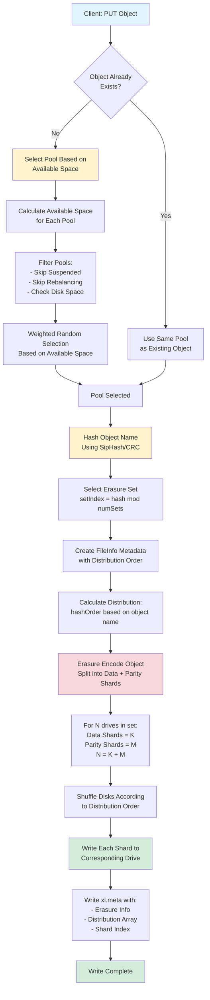
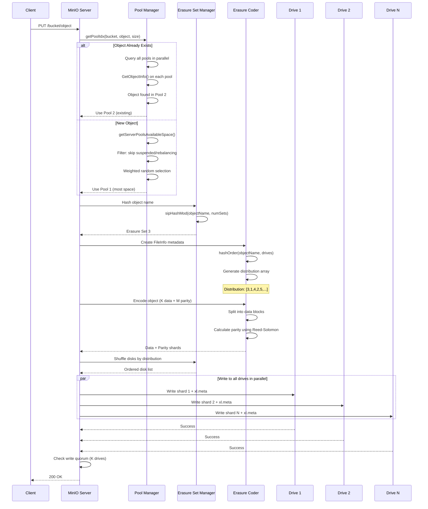

MinIO just does one thing - Object storage for Private cloud


Legacy object storage architecture


## Architecture

All the nodes running distributed MinIO setup are recommended to be homogeneous, i.e. same operating system, same number of drives and same network interconnects.

Start distributed MinIO instance on n nodes with m drives each mounted at `/export1` to `/exportm` (pictured below), by running this command on all the `n` nodes:


* No master server, no metadata server or anything

Ref: https://github.com/minio/minio/blob/master/docs/distributed/README.md


We will see Pools and Erasure coding in the following sections


## MinIO Server Pools


A server pool is a set of minio server nodes which pool their drives and resources, creating a unit of expansion. All nodes in a server pool share their hardware resources in an isolated namespace.  

The other important point here involves rebalance-free, non-disruptive expansion. With MinIO’s server pool approach - rebalancing is not required to expand. Ref: https://blog.min.io/no-rebalancing-object-storage/

A MinIO cluster is built on server pools, and server pools are built on erasure sets.

## Erasure coding

* Erasure sets, built per server pool, are sets of nodes and drives to which MinIO applies erasure coding to protect data from loss and corruption. 
* Erasure coding breaks objects into data and parity blocks and can use these blocks to reconstruct missing or corrupted blocks if necessary. With MinIO’s highest level of protection (8 parity or EC:8), you may lose up to half of the total drives and still recover data.
* For example, in a 16-drive setup, data can be split into 12 data shards and 4 parity shards, allowing the system to rebuild data even if up to 4 drives fail.

Data shards contain a portion of a given object. Parity shards contain a mathematical representation of the object used for rebuilding Data shards.


The value K here constitutes the read quorum for the deployment. The erasure set must therefore have at least K healthy drives in the erasure set to support read operations.


Here say we have small object which only has 1 part - `part.1`, now in this case, we have 2 data blocks and 2 parity blocks for this part.


Ref: https://blog.min.io/erasure-coding-vs-raid/

Not only does MinIO erasure coding protect objects against data loss in the event that multiple drives and nodes fail, MinIO also protects and heals at the object level. 
* The ability to heal one object at a time is a dramatic advantage over systems such as RAID that heal at the volume level.
* A corrupt object could be restored in MinIO in seconds vs. hours in RAID.


MinIO protects against `BitRot`, or silent data corruption, which can have many different causes such as power current spikes, bugs in disk firmware and even simply aging drives. 
* MinIO uses the `HighwayHash` algorithm to compute a hash on read and verify it on write from the application, across the network and to the storage media.
* This process is highly efficient - it can achieve hashing speeds over 10 GB/sec on a single core on Intel CPUs - and has minimal impact on normal read/write operations across the erasure set. https://github.com/google/highwayhash

### Read request


### Write request

Two cases:
* Case 1: Parity < 50% of drives
  - Write Quorum = Parity
* Case 2: Parity = 50% of drives
  - Write Quorum = Parity + 1

> If parity equals 1/2 (half) the number of erasure set drives, write quorum equals parity + 1 (one) to avoid data inconsistency due to 'split brain' scenarios.


## Put and Get Operation

### Storing an Object (The PUT Request)


- Choosing an erasure set for the object is decided during `PutObject()`, object names are used to find the right erasure set using the following pseudo code.

```go
// hashes the key returning an integer.
func sipHashMod(key string, cardinality int, id [16]byte) int {
        if cardinality <= 0 {
                return -1
        }
        sip := siphash.New(id[:])
        sip.Write([]byte(key))
        return int(sip.Sum64() % uint64(cardinality))
}
```

Input for the key is the object name specified in `PutObject()`, returns a unique index. This index is one of the erasure sets where the object will reside. This function is a consistent hash for a given object name i.e for a given object name the index returned is always the same.


When a client sends an object to the cluster, MinIO follows a specific sequence to ensure data is stored safely and evenly distributed.

* Step 1: Hashing: The object name is processed by a deterministic hash function to create a unique hash value.

* Step 2: Drive Selection: A modulus function is applied to that hash value. The result determines the specific set of drives (erasure set) where the data will live.

* Step 3: Erasure Coding: Simultaneously, the Erasure Code Engine processes the object data. It breaks the object into:
  - Data blocks: The actual content.
  - Parity blocks: Redundancy data for recovery.

* Step 4: Writing: These blocks are written to the prescribed drives.

Note: MinIO uses `SipHash` for this process. This algorithm ensures that objects are distributed evenly across all drives, resulting in near-uniform disk utilization.


For example, with 5 data blocks and 3 parity blocks




We are searching all the server pools in parallel to see if we find the object using the deterministic erasure set.





### Retrieving an Object (The GET Request)
To retrieve data, MinIO reverses the logic used during the write process.

* Step 1: Location Calculation: The client requests the file by name. MinIO runs the name through the same hash and modulus functions used during the PUT request to identify the correct drives immediately.

* Step 2: Retrieval: The system reads the object shards (blocks) from those specific drives.

* Step 3: Reassembly & Verification: The shards are passed back through the Erasure Code Engine. The engine reassembles the original object and verifies its integrity ("sanity check") to ensure no corruption occurred.

* Step 4: Delivery: The verified object is sent back to the client.

## Healing


Ref: https://minio-docs.tf.fo/operations/concepts/healing


Ref: https://minio-docs.tf.fo/operations/data-recovery

## Site to Site Replication


