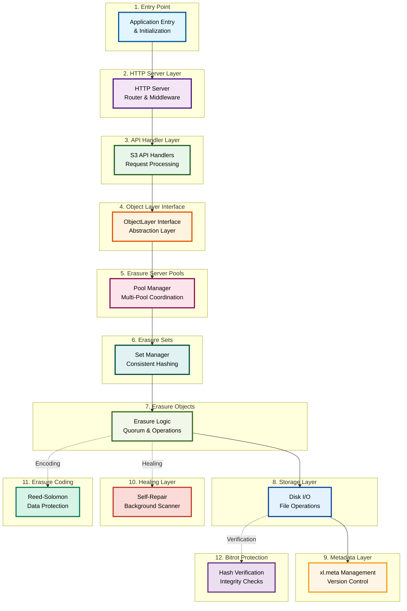
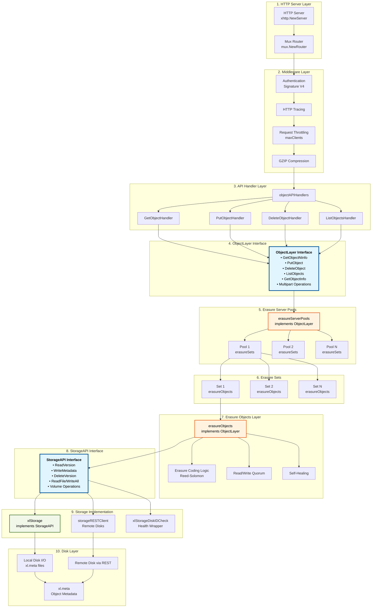
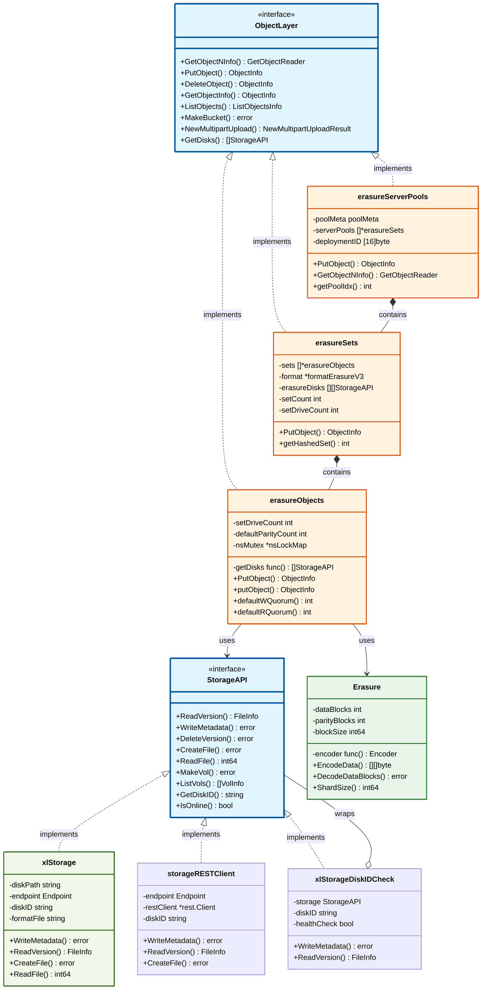
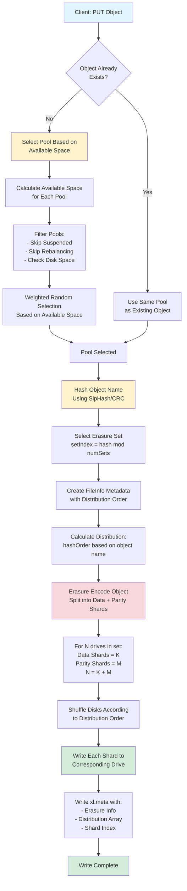
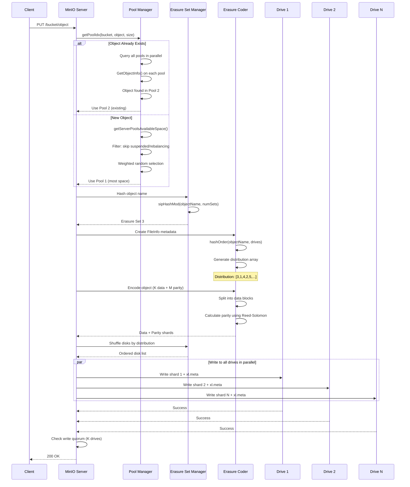
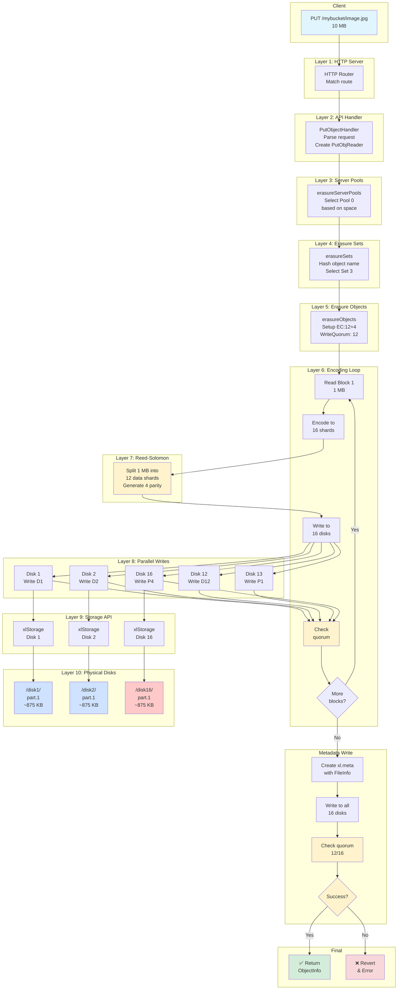

MinIO just does one thing - Object storage for Private cloud


* Minio adopts a metadata-free database design for high performance, avoiding the metabase becoming a performance bottleneck for the entire system, and limiting failures to a single cluster, so that no other clusters are involved.
* Minio is also fully compatible with the S3 interface, so it can also be used as a gateway to provide S3 access to the outside world.
* Use both Minio Erasure code and checksum to prevent hardware failures. Even if you lose more than half of your hard drive, you can still recover from it. (N/2)-1 node failure is also allowed in the distribution


### Legacy object storage architecture


## Architecture

All the nodes running distributed MinIO setup are recommended to be homogeneous, i.e. same operating system, same number of drives and same network interconnects.

Start distributed MinIO instance on n nodes with m drives each mounted at `/export1` to `/exportm` (pictured below), by running this command on all the `n` nodes:


* No master server, no metadata server or anything

Ref: https://github.com/minio/minio/blob/master/docs/distributed/README.md


We will see Pools and Erasure coding in the following sections


### Decentralized architecture

Minio adopts a decentralized shared-nothing architecture, where object data is scattered and stored on multiple hard disks on different nodes, providing unified namespace access and load balancing between servers through load balancing or DNS rounding

## MinIO Server Pools


A server pool is a set of minio server nodes which pool their drives and resources, creating a unit of expansion. All nodes in a server pool share their hardware resources in an isolated namespace.  

The other important point here involves rebalance-free, non-disruptive expansion. With MinIO’s server pool approach - rebalancing is not required to expand. Ref: https://blog.min.io/no-rebalancing-object-storage/

A MinIO cluster is built on server pools, and server pools are built on erasure sets.


## Code Structure






Interfaces in MinIO



## Erasure coding

* Erasure sets, built per server pool, are sets of nodes and drives to which MinIO applies erasure coding to protect data from loss and corruption. 
* Erasure coding breaks objects into data and parity blocks and can use these blocks to reconstruct missing or corrupted blocks if necessary. With MinIO’s highest level of protection (8 parity or EC:8), you may lose up to half of the total drives and still recover data.
* For example, in a 16-drive setup, data can be split into 12 data shards and 4 parity shards, allowing the system to rebuild data even if up to 4 drives fail.

Data shards contain a portion of a given object. Parity shards contain a mathematical representation of the object used for rebuilding Data shards.


The value K here constitutes the read quorum for the deployment. The erasure set must therefore have at least K healthy drives in the erasure set to support read operations.


Here say we have small object which only has 1 part - `part.1`, now in this case, we have 2 data blocks and 2 parity blocks for this part.


Ref: https://blog.min.io/erasure-coding-vs-raid/

Not only does MinIO erasure coding protect objects against data loss in the event that multiple drives and nodes fail, MinIO also protects and heals at the object level. 
* The ability to heal one object at a time is a dramatic advantage over systems such as RAID that heal at the volume level.
* A corrupt object could be restored in MinIO in seconds vs. hours in RAID.


MinIO protects against `BitRot`, or silent data corruption, which can have many different causes such as power current spikes, bugs in disk firmware and even simply aging drives. 
* MinIO uses the `HighwayHash` algorithm to compute a hash on read and verify it on write from the application, across the network and to the storage media.
* This process is highly efficient - it can achieve hashing speeds over 10 GB/sec on a single core on Intel CPUs - and has minimal impact on normal read/write operations across the erasure set. https://github.com/google/highwayhash

### Read request


### Write request

Two cases:
* Case 1: Parity < 50% of drives
  - Write Quorum = Parity
* Case 2: Parity = 50% of drives
  - Write Quorum = Parity + 1

> If parity equals 1/2 (half) the number of erasure set drives, write quorum equals parity + 1 (one) to avoid data inconsistency due to 'split brain' scenarios.


## Put and Get Operation

### Storing an Object (The PUT Request)


- Choosing an erasure set for the object is decided during `PutObject()`, object names are used to find the right erasure set using the following pseudo code.

```go
// hashes the key returning an integer.
func sipHashMod(key string, cardinality int, id [16]byte) int {
        if cardinality <= 0 {
                return -1
        }
        sip := siphash.New(id[:])
        sip.Write([]byte(key))
        return int(sip.Sum64() % uint64(cardinality))
}
```

Input for the key is the object name specified in `PutObject()`, returns a unique index. This index is one of the erasure sets where the object will reside. This function is a consistent hash for a given object name i.e for a given object name the index returned is always the same.


When a client sends an object to the cluster, MinIO follows a specific sequence to ensure data is stored safely and evenly distributed.

* Step 1: Hashing: The object name is processed by a deterministic hash function to create a unique hash value.

* Step 2: Drive Selection: A modulus function is applied to that hash value. The result determines the specific set of drives (erasure set) where the data will live.

* Step 3: Erasure Coding: Simultaneously, the Erasure Code Engine processes the object data. It breaks the object into:
  - Data blocks: The actual content.
  - Parity blocks: Redundancy data for recovery.

* Step 4: Writing: These blocks are written to the prescribed drives.

Note: MinIO uses `SipHash` for this process. This algorithm ensures that objects are distributed evenly across all drives, resulting in near-uniform disk utilization.


For example, with 5 data blocks and 3 parity blocks




We are searching all the server pools in parallel to see if we find the object using the deterministic erasure set.








### Retrieving an Object (The GET Request)
To retrieve data, MinIO reverses the logic used during the write process.

* Step 1: Location Calculation: The client requests the file by name. MinIO runs the name through the same hash and modulus functions used during the PUT request to identify the correct drives immediately.

* Step 2: Retrieval: The system reads the object shards (blocks) from those specific drives.

* Step 3: Reassembly & Verification: The shards are passed back through the Erasure Code Engine. The engine reassembles the original object and verifies its integrity ("sanity check") to ensure no corruption occurred.

* Step 4: Delivery: The verified object is sent back to the client.

## Healing


Ref: https://minio-docs.tf.fo/operations/concepts/healing


Ref: https://minio-docs.tf.fo/operations/data-recovery

## Site to Site Replication


## Use of distributed locking


Ref: https://blog.min.io/minio-dsync-a-distributed-locking-and-syncing-package-for-go/

### Distributed lock management

Similar to distributed databases, Minio suffers from data consistency issues: while one client reads an object, another client may be modifying or deleting the object. To avoid inconsistencies. Minio specifically designed and implemented the dsync distributed lock manager to control data consistency.

* A lock request from any one node is broadcast to all online nodes in the cluster
* If consent is received from N/2+1 nodes, the acquisition is successful
* There is no master node, each node is peered to each other, and the stale lock detection mechanism is used between nodes to determine the status of nodes and the lock status
* Due to the simple design, it is relatively rough. It has certain defects, and supports up to 32 nodes. Scenarios where lock loss cannot be avoided. However, the available needs are basically met.

Lock throughput decreases as cluster grows.

Ref: https://e-whisper.com/posts/9462/

## MinIO Object Storage Gateway [Deprecated]

In addition to being a storage system service, Minio can also be used as a gateway, and the backend can be used with distributed file systems such as NAS systems and HDFS systems, or third-party storage systems such as S3 and OSS. With the Minio gateway, S3-compatible APIs can be added to these back-end systems for easy management and portability, because S3 APIs are already a de facto label in the object storage world.


* MinIO introduced the gateway feature early on to help make the S3 API ubiquitous. From legacy POSIX-based SAN/NAS systems to modern cloud storage services, the different MinIO gateway modules brought S3 API compatibility where it did not exist previously.
* The primary objective was to provide sufficient time to port the applications over a modern cloud-native architecture.
* In the gateway mode, MinIO ran as a stateless proxy service, performing inline translation of the object storage functions from the S3 API to their corresponding equivalent backend functions.
* At any given time, the MinIO gateway service could be turned off and the only loss was S3 compatibility. The objects were always written to the backend in their native format, be it NFS or Azure Blob, or HDFS. 


* The Gateway was initially developed to allow customers to use the S3 API to work with backends, such as NFS, Azure Blob and HDFS, that would not otherwise support it.
* The S3 API is ubiquitous (thanks in part to MinIO Gateway), but if we were to continue developing the MinIO Gateway, we would simply be perpetuating older technologies that are neither high-performance nor cloud-native. Also, addressing the ongoing technical challenges required to maintain MinIO Gateway for each backend are time and resource intensive so it makes much more sense to deprecate it entirely.

Reason for deprecation:
* The S3 API has evolved considerably since we started, and what began as inline translation morphed into something much more.
* Critical S3 capabilities like versioning, bucket replication, immutability/object locking, s3-select, encryption, and compression couldn’t be supported in the gateway mode without introducing a proprietary backend format.
* It would defeat the purpose of the gateway mode because the backend could no longer be read directly without the help of the gateway service.
* The backends would merely act as storage media for the gateway and you might as well run MinIO in server mode. Thus it became a compromise that MinIO no longer wanted to engage in. This meant it was time for us to let go. 

Ref: https://blog.min.io/minio-gateway-migration/ and https://blog.min.io/deprecation-of-the-minio-gateway/ 

## Beyond the Basics: What Else Can MinIO Do?

While we have only scratched the surface, MinIO is packed with advanced features:

* Versioning: Keep multiple versions of an object. Accidentally overwrote a file? No problem, just revert to an earlier version!

* Object Locking (WORM): Enforce "Write Once, Read Many" protection, making data immutable for compliance or security. Once written, it cannot be changed or deleted for a set period.

* Lifecycle Management: Automatically move or delete objects after a certain time, saving storage costs.

* Identity and Access Management (IAM): Control who can access what, just like in a big cloud environment. You can create users, groups, and define fine grained policies.

* Replication: Copy data automatically across different MinIO instances for disaster recovery and high availability.


## Encryption


## TODO
* https://blog.min.io/minio-versioning-metadata-deep-dive/


## MinIO Backend Storage Metadata on Nodes

https://blog.min.io/minio-versioning-metadata-deep-dive/

Inside `.minio.sys/format.json` on a node

`minio1/.minio.sys$ cat format.json  | jq`

```json
{
  "version": "1",
  "format": "xl",
  "id": "f9a7a6ba-39d9-4483-bb47-fe86518bdc67",
  "xl": {
    "version": "3",
    "this": "9ae64de8-1c75-46df-b09d-ad8b97f95313",
    "sets": [
      [
        "4199dbce-78ba-4176-846d-7423ab6cfcd9",
        "22b83b76-f883-49c8-abc8-a3cf84eb92f4",
        "9ae64de8-1c75-46df-b09d-ad8b97f95313",
        "fc1a7dde-1da7-44cc-9380-3ae3063c415c",
        "48d7881f-6e93-42ab-9d89-f27bf0648b0d",
        "b8cfec44-f88b-4193-9575-368d92eefb16",
        "ef66b6f7-3c15-45fa-aca8-52286f4750f4",
        "02b3aa13-ff62-4e46-a196-f40b6f531c23",
        "f5dd8d65-56d7-40f2-9035-b4b37e3018a5",
        "ae4e30fd-db65-4c0e-a9c1-44f50191ba20",
        "d4cf829c-b96f-4687-845c-8884a43a6397",
        "2efc58b9-253a-4ac6-ba92-a316811f896c"
      ]
    ],
    "distributionAlgo": "SIPMOD+PARITY"
  }
}
```

Explanation: Cluster has:

* 1 erasure set with 12 disks (UUIDs in the sets array)
* Deployment ID: f9a7a6ba-39d9-4483-bb47-fe86518bdc67 (the id field)
* Distribution Algorithm: SIPMOD+PARITY (the distributionAlgo field)
* This disk: 9ae64de8-1c75-46df-b09d-ad8b97f95313 (position 2 in the set)
