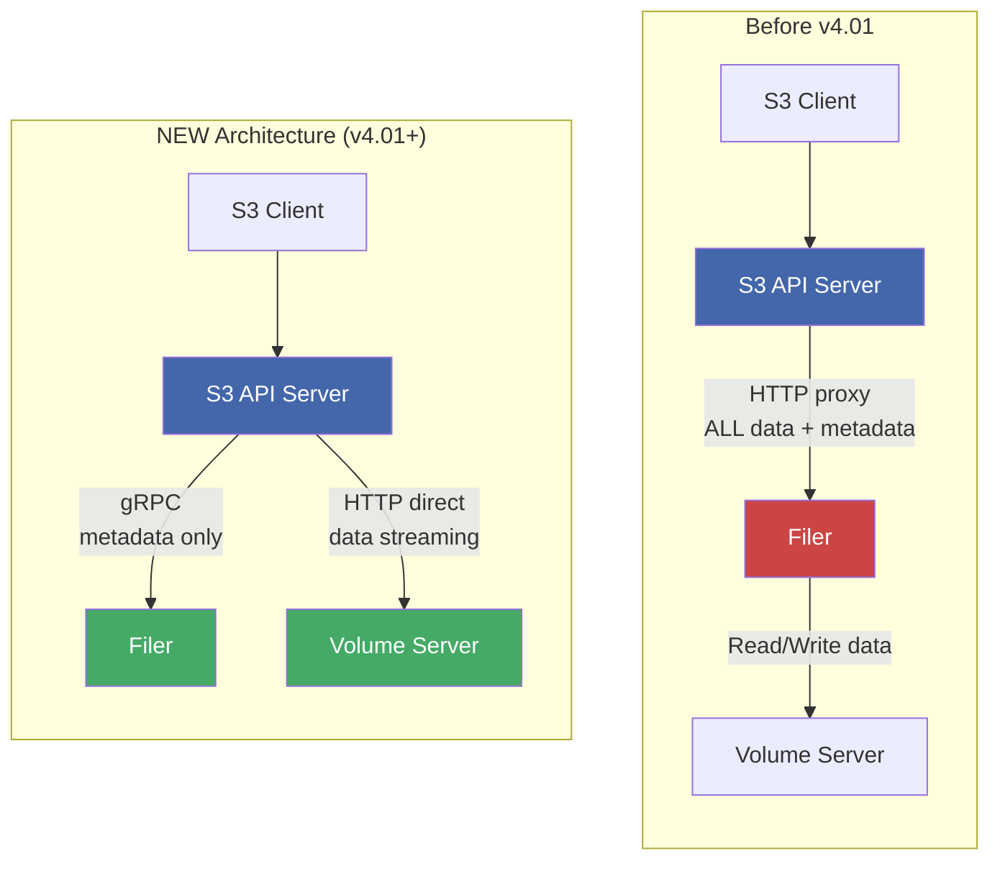
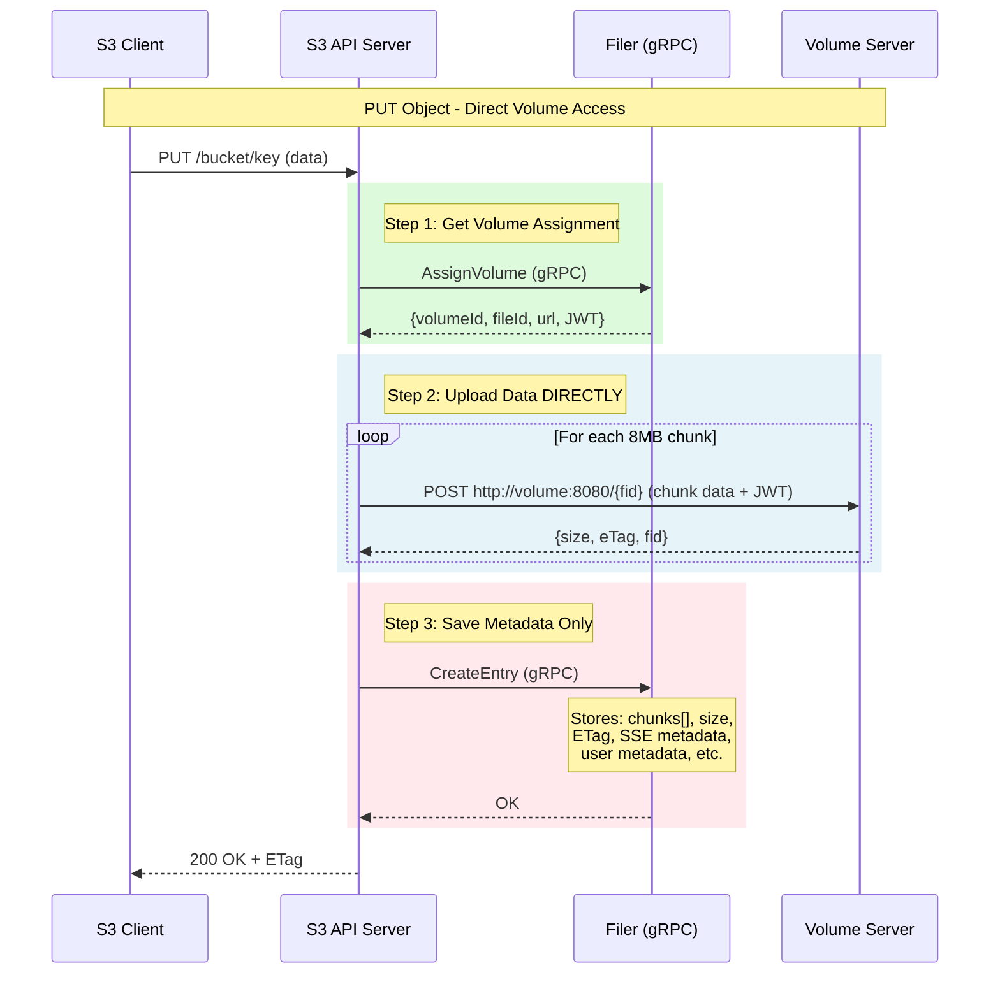
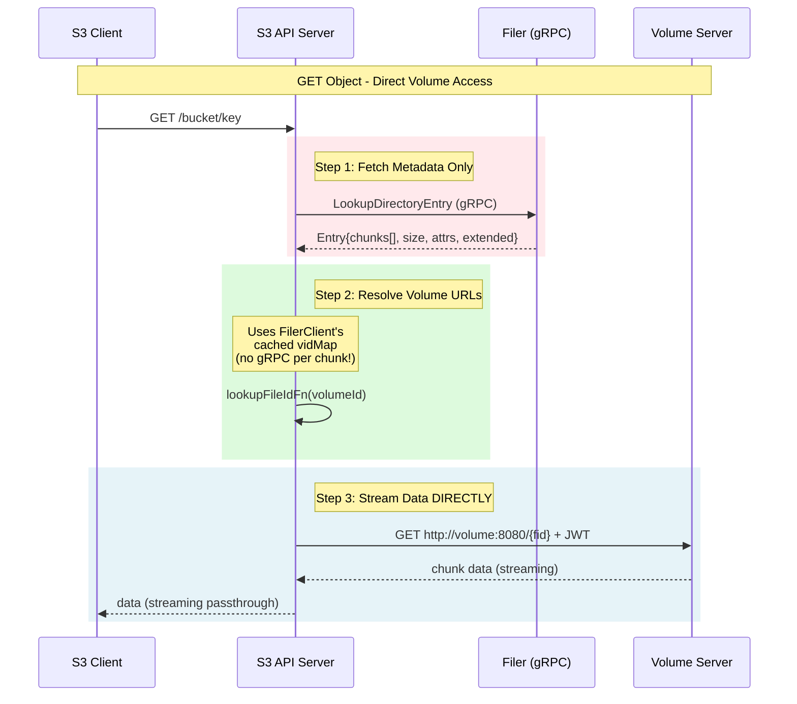
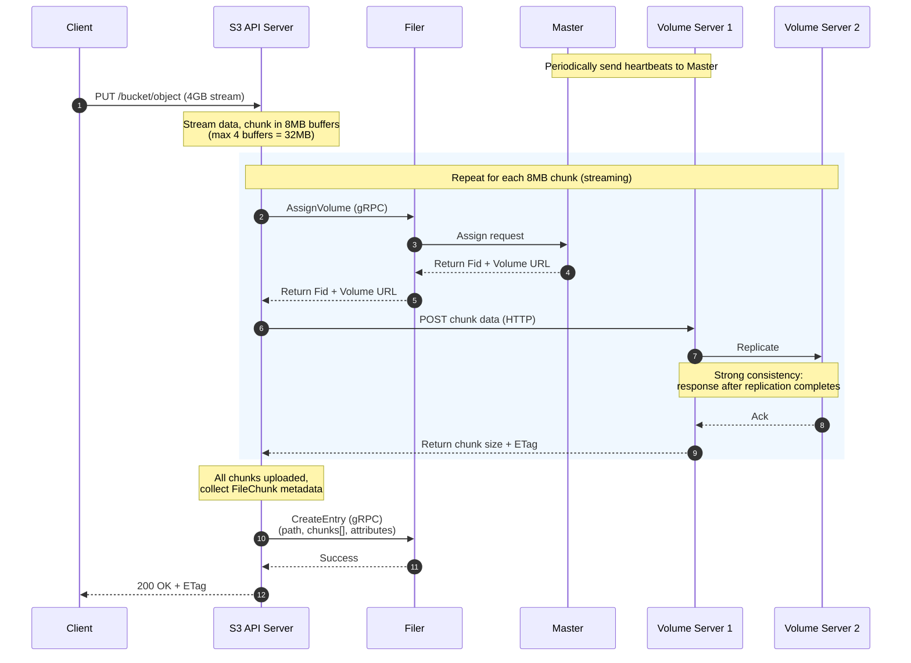

## Components


Ref: https://gear.hermygong.com/p/seaweeds/

## Blob storage


Other Blobstore operations


### Write


### Read


## File Storage


Filer Architecture


Ref: https://www.a-programmer.top/2021/06/19/SeaweedFS%E5%88%9D%E6%8E%A2/


### Filer Store Data Model


## Volume Server


Volume


In SeaweedFS, a volume is a single file consisting of many small files. When a master server starts, it sets the volume file maximum size to 30GB (see: -volumeSizeLimitMB). At volume server initialization, it will create 8 of these volumes (see: -max).

Each volume has its own TTL and replication.

Ref: https://github.com/seaweedfs/seaweedfs/wiki/Components

### Volume Files Structure


Ref: https://github.com/seaweedfs/seaweedfs/wiki/Volume-Files-Structure

## Architecture


## Design Philosophy


## High Availability


In Master, How Raft is Used
* Leader Election: Multiple master servers form a Raft cluster to elect a leader. Only the leader can assign new volume IDs.
* Volume ID Assignment: When a new volume needs to be created, the leader:
  - Gets the current max volume ID
  - Increments it
  - Replicates this new max via Raft to ensure all masters agree

Also master manages, all these
* Assign file ID	- `Leader only (proxied if needed)`
* Volume creation	- `Leader only`
* NextVolumeId (Raft write)	- `Leader only + barrier`
* Volume lookup	Leader uses local topology, non-leader queries too
* Client connections	- Any master, but redirected to leader


## Replication


## Erasure Coding

* SeaweedFS uses Reed-Solomon erasure coding with a default 10+4 scheme (10 data shards + 4 parity shards = 14 total shards). 
* This allows you to lose up to 4 volume servers and still recover your data.
* Only volumes with this fullness ratio 80% or higher will be erasure coded, configurable

```
/*

Steps to apply erasure coding to .dat .idx files
0. ensure the volume is readonly
1. client call VolumeEcShardsGenerate to generate the .ecx and .ec00 ~ .ec13 files
2. client ask master for possible servers to hold the ec files
3. client call VolumeEcShardsCopy on above target servers to copy ec files from the source server
4. target servers report the new ec files to the master
5.   master stores vid -> [14]*DataNode
6. client checks master. If all 14 slices are ready, delete the original .idx, .idx files

*/
```

Ref: seaweedfs/weed/server/volume_grpc_erasure_coding.go

## S3 changes


Ref: SeaweedFS S3 API in 2025: Enterprise‑grade security and control - Chris Lu, SeaweedFS KubeCon

Changes related to this `S3 data path skips filer`  https://github.com/seaweedfs/seaweedfs/pull/7481
* Check this file `weed/s3api/s3api_object_handlers_put.go` previously it used Filer Proxy `proxyReq, err := http.NewRequest(http.MethodPut, uploadUrl, body)`, now S3 api directly talks to volume server


Change



### Write Path



### Read Path



### How Large file is written to S3?


