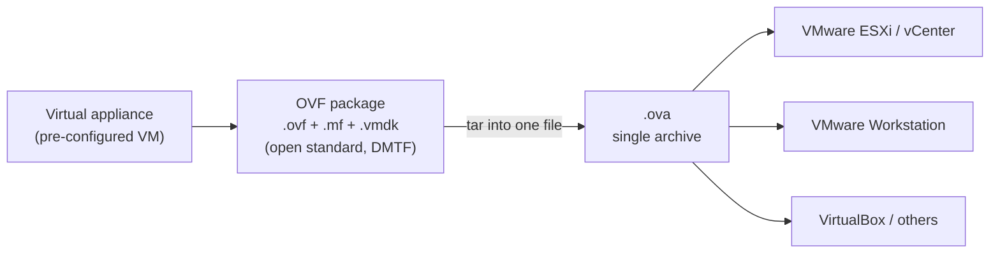
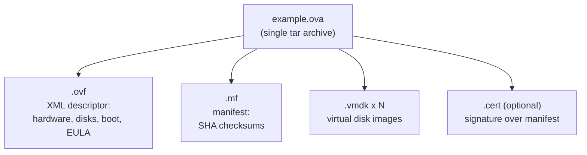

Portable formats for packaging and distributing a virtual machine (or a set of
VMs / a vApp) so it can be deployed on any compatible hypervisor.

## In short

* A **virtual appliance** = a pre-configured VM image ready to run on a
  hypervisor. OVF/OVA is how you ship it.
* **OVF** is an **open standard** (maintained by the **DMTF**) for packaging and
  distributing such appliances — one or more VMs plus the metadata needed to
  deploy and run them.
* **OVA** is simply an **OVF package rolled into a single `.tar` archive** with
  the `.ova` extension — easier to move as one file.
* **Cross-platform:** importable by VMware (Workstation / ESXi / vCenter),
  VirtualBox, and others → deploy a complex appliance in one step instead of
  configuring from scratch.



## OVF (Open Virtualization Format)

A **folder / set of files** describing one deployable appliance:

```
OVF = descriptor.ovf   (XML: hardware spec, disk list, boot order, EULA, networks)
    + manifest.mf      (SHA checksums of the other files)
    + disk1.vmdk, disk2.vmdk, ...   (the actual virtual disks)
    [ + certificate.cert ]          (optional signature over the manifest)
```

* **`.ovf`** — XML descriptor. Virtual hardware (CPU, RAM, disks, NICs), disk
  references, boot order, product/EULA info, OVF properties (deploy-time
  parameters), and the network mapping. No VM data itself.
* **`.mf`** — manifest listing SHA checksums of every file in the package, so a
  deploy can verify integrity.
* **`.vmdk`** — the real disk images (usually compressed/streamOptimized for
  distribution).
* **`.cert`** *(optional)* — X.509 signature over the manifest for authenticity.

## OVA (Open Virtual Appliance)

The **same contents rolled into a single `tar` archive** (`.ova`):

```
OVA = tar( descriptor.ovf + manifest.mf + disk1.vmdk + ... )
```

```
-----------------------
|       OVA File      |  (example.ova)
|  ----------------   |
|  | .ovf file     |  |
|  | Descriptor of |  |  -> Descriptor of the VM, XML format
|  | the VM        |  |
|  ----------------   |
|  ----------------   |
|  | .vmdk file(s) |  |
|  | VM Disk Image |  |  -> Virtual Machine Disk files
|  ----------------   |
|  ----------------   |
|  | .mf file      |  |
|  | Manifest      |  |  -> Manifest, contains checksums
|  ----------------   |
-----------------------
```

Just a packaging convenience — one file to move around instead of a folder.
Unpacking an `.ova` gives back the OVF file set.



## OVF vs OVA

| | OVF | OVA |
|---|---|---|
| Layout | Multiple files (folder) | Single `.tar` file (`.ova`) |
| Transport | Move all files together | One file, easy to share |
| Edit descriptor | Directly edit `.ovf` | Must untar first |
| Deploy | Both deploy the same way (vCenter/ESXi "Deploy OVF Template") |

## Notes

* Deploy via vCenter/ESXi **"Deploy OVF Template"** (accepts either `.ovf` or
  `.ova`); `ovftool` is the CLI for converting/deploying/exporting.
* During deploy you choose the target **datastore** and **disk provisioning**
  (thin / thick), and set any **OVF properties** the descriptor exposes.
* Export a VM to OVF/OVA with **File → Export OVF Template** or `ovftool`.
