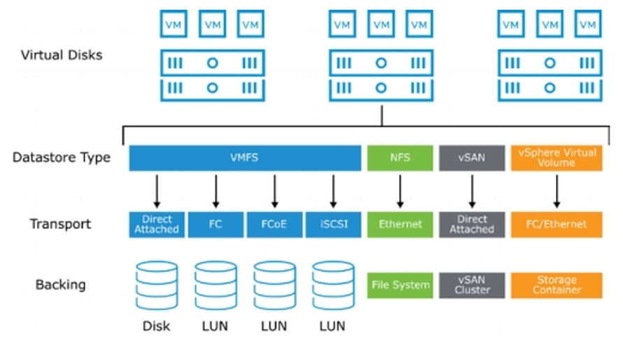

vSphere presents guest **virtual disks (VMDKs)** on top of a **datastore** — a
logical storage layer that sits on physical devices/server disk and holds the
VMDKs plus the rest of a VM's files (config, logs, swap, snapshots). The
datastore type decides the transport and the backing store — and what
data-integrity and redundancy guarantees exist *below* the guest OS.

### Datastore

> The **connection type you use is what determines the datastore type** you work
> with.

Ref: https://virtualextract.wordpress.com/2022/06/18/vmware-vsphere-storage/

Previously

## Datastore types

| Datastore type | Transport | Backing | Redundancy of its own | Bitrot detect + repair |
|---|---|---|---|---|
| **VMFS** | Direct-attached / FC / FCoE / iSCSI | Disk or LUN | None — inherits from the array/RAID below (or nothing on local disk) | No (depends entirely on the array) |
| **NFS** | Ethernet | Filer file system | Whatever the NAS provides | Not from VMware — depends on filer (NetApp/ZFS have it, others may not) |
| **vSAN** | Direct-attached (pooled local disks) | vSAN cluster | Built-in, policy-driven **FTT** (mirror / erasure across hosts) | Yes — end-to-end checksum on by default (since vSAN 6.2) + scrubber |
| **vSphere Virtual Volume (vVol)** | FC / Ethernet | Storage container (array-managed) | Array-defined via VASA policy | Depends on array |

### VMFS

VMFS is a high-performance cluster file system (CFS) that enables virtualization to scale beyond the boundaries
of a single system.

Ref: https://www.vmware.com/docs/vmware-vsphere-vmfs

### Transports behind each type

* **VMFS** is a clustering filesystem optimized for VM files; it can sit on
  several connection types:
  * **DAS (Direct-Attached Storage)** — local disks in the server (SAS / SATA /
    SCSI). Often used for the ESXi OS install with RAID. Local disks **cannot back
    a shared datastore** — other hosts can't reach them.
  * **Fibre Channel (FC)** — SAN over fibre; LUNs presented to ESXi and formatted
    VMFS.
  * **FCoE** — encapsulates FC traffic in Ethernet, so SAN and LAN share one cable.
  * **iSCSI** — maps SCSI over TCP/IP to carry SAN traffic on Ethernet.
* **NFS** is a file-based share over Ethernet (TCP/IP). Unlike iSCSI/FCoE it
  **is not formatted** by ESXi — it's a distributed file share mounted as-is.
* **vSAN** is software-defined storage that aggregates each host's local disks
  into one logical pool, removing the need for a physical SAN appliance.

  
* **vVols** connect to NAS/SAN arrays over FC/Ethernet and are driven by VM
  storage policies (disk type, RAID level, dedup); the array auto-creates the
  right LUN. Requires **VAAI/VASA** array integration.

FC, FCoE, and iSCSI LUNs can be mapped to **multiple** ESXi hosts → shared
datastores; DAS cannot.

### Key distinction: VMFS vs vSAN

* **VMFS is a clustered *filesystem*, not a *protector*.** It stores VMDK blocks
  on one LUN/disk and verifies nothing over time. Any integrity/redundancy comes
  from the layer below (enterprise array scrubbing / T10 DIF-PI), which varies by
  vendor and is absent on local disk.
* **vSAN is a software-defined storage layer that owns integrity + redundancy.**
  Object checksum (CRC-32C) is enabled by default and a background scrubber
  repairs mismatches from the FTT copy. FTT=1 (mirror) costs 2x raw, FTT=2 costs
  3x raw.

## Bitrot: detect vs. repair

* **Detection** = noticing a block is corrupt (checksums). **Repair/heal** =
  reconstructing the good data. Repair needs redundancy (a parity/replica copy);
  detection alone just flags the object as unreadable.
* On **plain VMFS / local disk**: neither, unless the array provides it.
* On **vSAN**: both (checksum + FTT replica).

## Thin provisioning gotcha

Datastore file size for a thin VMDK = **actual consumed**, not provisioned. A
257 GB thin disk with 60 GB used shows as a ~62 GB `.vmdk` file. When matching
VMDKs (datastore Files view) to guest disks (`lsblk`), compare *actual* usage,
not provisioned size, or they will look mismatched.
